# Daily Stock Analysis

This report provides an overview of selected stocks with volatility contraction patterns and analysis details.

## Stocks Overview

### 11/13/2024

#### AAOI
- **Current Price**: 27.26
- **Support Price**: 15.619999885559082
- **Pressure Price**: 19.0
- **Good Pivot**: True
- **Deep Correction**: False
- **Demand Dry**: True
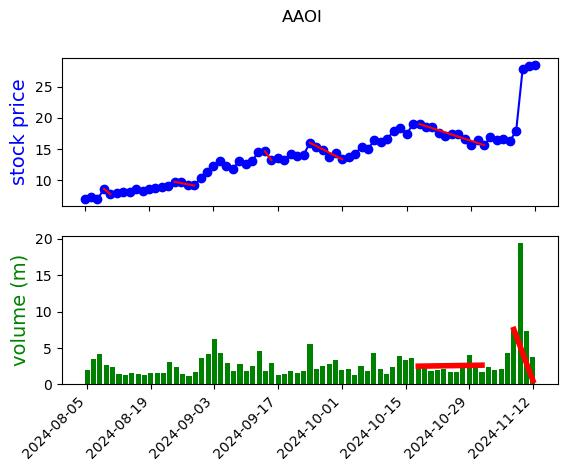

#### AIRG
- **Current Price**: 9.35
- **Support Price**: 9.1899995803833
- **Pressure Price**: 9.670000076293945
- **Good Pivot**: True
- **Deep Correction**: False
- **Demand Dry**: True
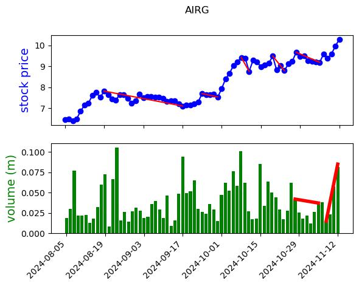

#### ALKT
- **Current Price**: 37.79
- **Support Price**: 37.599998474121094
- **Pressure Price**: 39.86000061035156
- **Good Pivot**: True
- **Deep Correction**: False
- **Demand Dry**: True
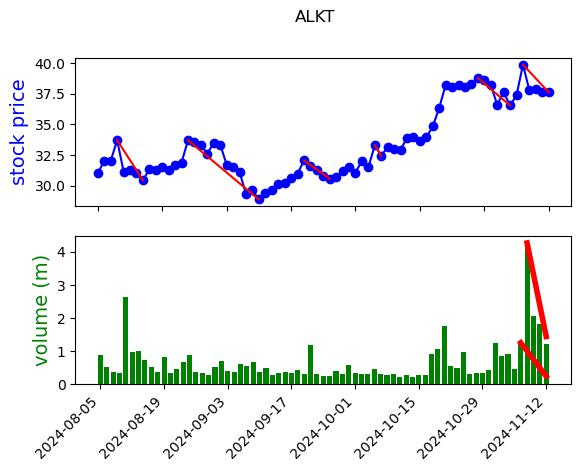

#### ALTR
- **Current Price**: 103.82
- **Support Price**: 103.6500015258789
- **Pressure Price**: 110.66999816894531
- **Good Pivot**: True
- **Deep Correction**: False
- **Demand Dry**: True
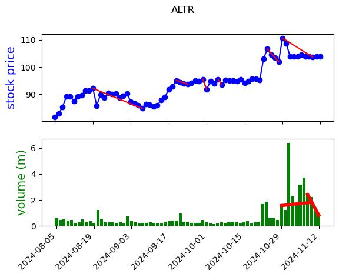

#### AVPT
- **Current Price**: 16.03
- **Support Price**: 12.140000343322754
- **Pressure Price**: 12.4399995803833
- **Good Pivot**: True
- **Deep Correction**: False
- **Demand Dry**: True
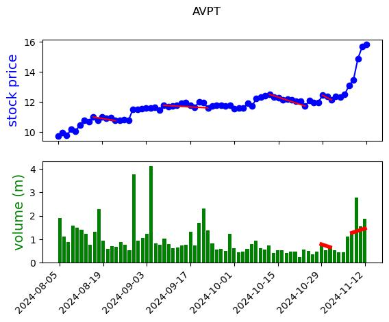

#### BCOV
- **Current Price**: 2.98
- **Support Price**: 2.069999933242798
- **Pressure Price**: 2.4200000762939453
- **Good Pivot**: True
- **Deep Correction**: False
- **Demand Dry**: True

#### CARG
- **Current Price**: 36.57
- **Support Price**: 31.020000457763672
- **Pressure Price**: 32.150001525878906
- **Good Pivot**: True
- **Deep Correction**: False
- **Demand Dry**: True

#### CCLDO
- **Current Price**: 17.5525
- **Support Price**: 12.300000190734863
- **Pressure Price**: 12.5
- **Good Pivot**: True
- **Deep Correction**: False
- **Demand Dry**: True
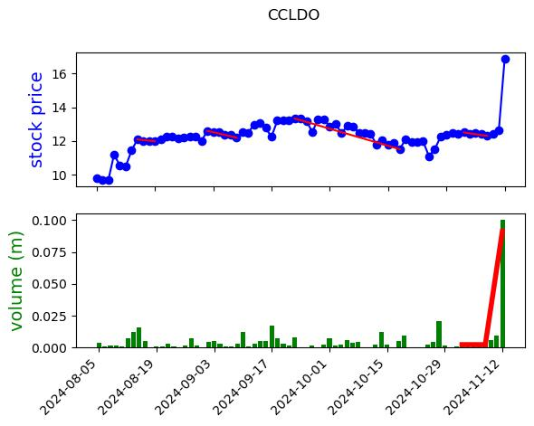

#### CCLDP
- **Current Price**: 17.36
- **Support Price**: 11.920000076293945
- **Pressure Price**: 12.300000190734863
- **Good Pivot**: True
- **Deep Correction**: False
- **Demand Dry**: True

#### CLMB
- **Current Price**: 121.57
- **Support Price**: 118.27999877929688
- **Pressure Price**: 122.41999816894531
- **Good Pivot**: True
- **Deep Correction**: False
- **Demand Dry**: True

#### CYBR
- **Current Price**: 291.61
- **Support Price**: 274.1000061035156
- **Pressure Price**: 300.05999755859375
- **Good Pivot**: True
- **Deep Correction**: False
- **Demand Dry**: True
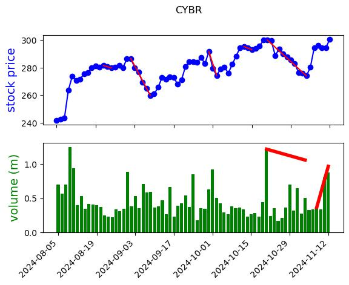

#### EXFY
- **Current Price**: 2.81
- **Support Price**: 1.840000033378601
- **Pressure Price**: 1.9600000381469727
- **Good Pivot**: True
- **Deep Correction**: False
- **Demand Dry**: True
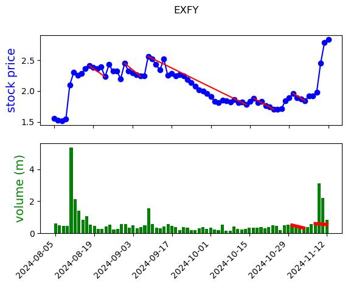

#### FTNT
- **Current Price**: 97.88
- **Support Price**: 77.91999816894531
- **Pressure Price**: 82.87000274658203
- **Good Pivot**: True
- **Deep Correction**: False
- **Demand Dry**: True
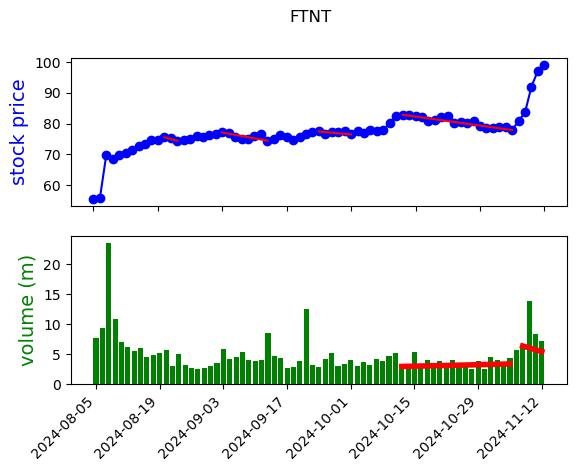

#### GAN
- **Current Price**: 1.82
- **Support Price**: 1.7300000190734863
- **Pressure Price**: 1.7400000095367432
- **Good Pivot**: True
- **Deep Correction**: False
- **Demand Dry**: True
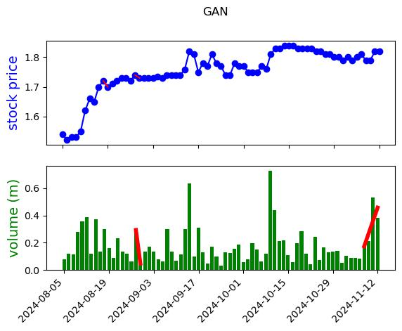

#### IBEX
- **Current Price**: 19.94
- **Support Price**: 19.479999542236328
- **Pressure Price**: 20.18000030517578
- **Good Pivot**: True
- **Deep Correction**: False
- **Demand Dry**: True

#### INOD
- **Current Price**: 39.33
- **Support Price**: 20.110000610351562
- **Pressure Price**: 21.68000030517578
- **Good Pivot**: True
- **Deep Correction**: False
- **Demand Dry**: True
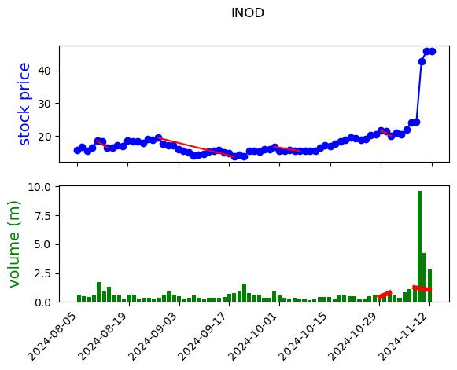

#### IONQ
- **Current Price**: 26.76
- **Support Price**: 23.010000228881836
- **Pressure Price**: 24.790000915527344
- **Good Pivot**: True
- **Deep Correction**: False
- **Demand Dry**: True
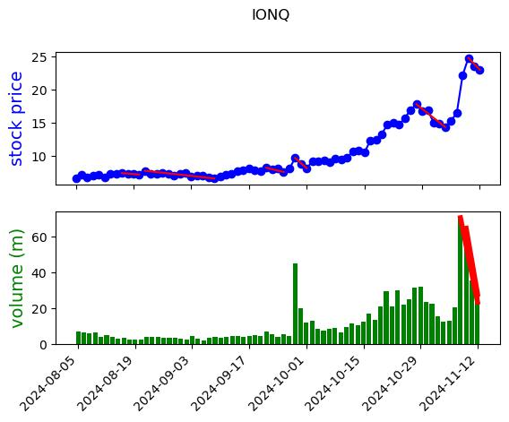

#### ISSC
- **Current Price**: 7.73
- **Support Price**: 7.190000057220459
- **Pressure Price**: 7.340000152587891
- **Good Pivot**: True
- **Deep Correction**: False
- **Demand Dry**: True

#### KD
- **Current Price**: 28.7
- **Support Price**: 22.889999389648438
- **Pressure Price**: 25.15999984741211
- **Good Pivot**: True
- **Deep Correction**: False
- **Demand Dry**: True
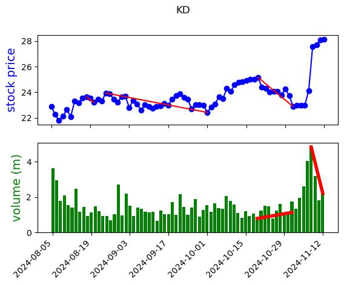

#### KLTR
- **Current Price**: 2.06
- **Support Price**: 1.309999942779541
- **Pressure Price**: 1.3899999856948853
- **Good Pivot**: True
- **Deep Correction**: False
- **Demand Dry**: True
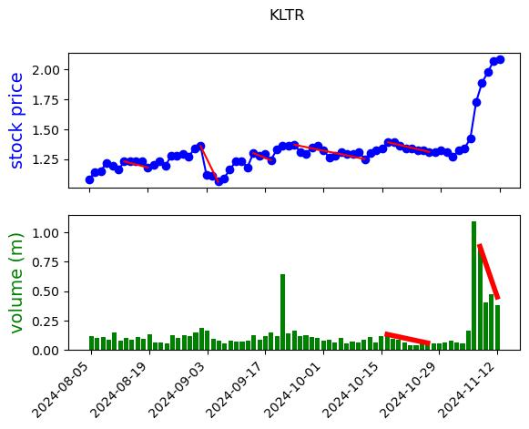

#### KVYO
- **Current Price**: 36.67
- **Support Price**: 33.349998474121094
- **Pressure Price**: 40.36000061035156
- **Good Pivot**: True
- **Deep Correction**: False
- **Demand Dry**: True
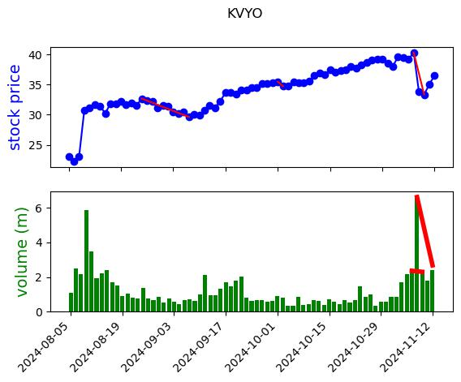

#### MGNI
- **Current Price**: 16.8
- **Support Price**: 12.199999809265137
- **Pressure Price**: 12.800000190734863
- **Good Pivot**: True
- **Deep Correction**: False
- **Demand Dry**: True
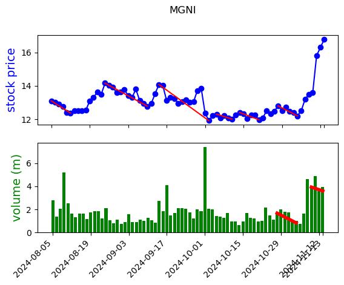

#### MTLS
- **Current Price**: 7.34
- **Support Price**: 5.909999847412109
- **Pressure Price**: 6.389999866485596
- **Good Pivot**: True
- **Deep Correction**: False
- **Demand Dry**: True
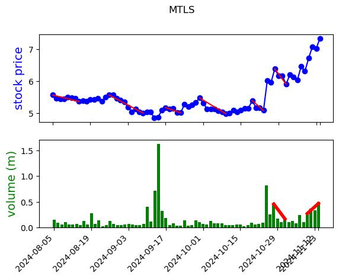

#### NYAX
- **Current Price**: 28.0
- **Support Price**: 26.229999542236328
- **Pressure Price**: 29.450000762939453
- **Good Pivot**: True
- **Deep Correction**: False
- **Demand Dry**: True

#### OS
- **Current Price**: 34.45
- **Support Price**: 29.100000381469727
- **Pressure Price**: 32.65999984741211
- **Good Pivot**: True
- **Deep Correction**: False
- **Demand Dry**: True
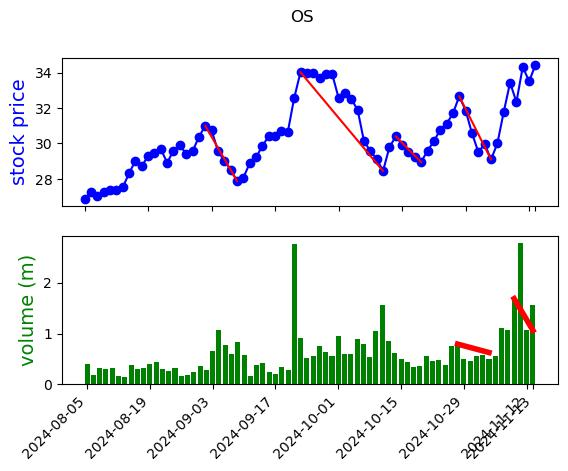

#### PLTR
- **Current Price**: 60.7
- **Support Price**: 41.40999984741211
- **Pressure Price**: 44.970001220703125
- **Good Pivot**: True
- **Deep Correction**: False
- **Demand Dry**: True
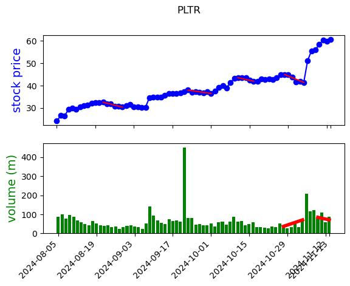

#### QUBT
- **Current Price**: 2.66
- **Support Price**: 1.0499999523162842
- **Pressure Price**: 1.2799999713897705
- **Good Pivot**: True
- **Deep Correction**: False
- **Demand Dry**: True

#### RBLX
- **Current Price**: 53.14
- **Support Price**: 53.13999938964844
- **Pressure Price**: 54.560001373291016
- **Good Pivot**: True
- **Deep Correction**: False
- **Demand Dry**: True
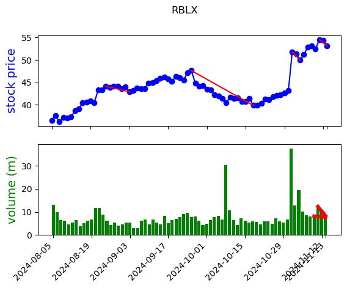

#### RDCM
- **Current Price**: 11.99
- **Support Price**: 10.449999809265137
- **Pressure Price**: 10.670000076293945
- **Good Pivot**: True
- **Deep Correction**: False
- **Demand Dry**: True
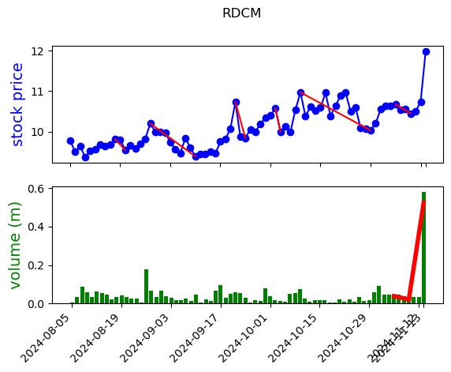

#### RDVT
- **Current Price**: 34.42
- **Support Price**: 34.41999816894531
- **Pressure Price**: 35.29999923706055
- **Good Pivot**: True
- **Deep Correction**: False
- **Demand Dry**: True
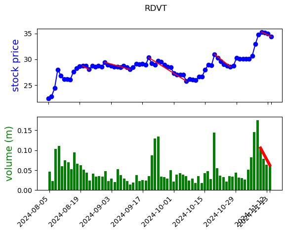

#### RNG
- **Current Price**: 37.94
- **Support Price**: 36.209999084472656
- **Pressure Price**: 38.79999923706055
- **Good Pivot**: True
- **Deep Correction**: False
- **Demand Dry**: True

#### SCKT
- **Current Price**: 1.39
- **Support Price**: 1.1399999856948853
- **Pressure Price**: 1.1799999475479126
- **Good Pivot**: True
- **Deep Correction**: False
- **Demand Dry**: True

#### SHOP
- **Current Price**: 115.09
- **Support Price**: 78.20999908447266
- **Pressure Price**: 83.68000030517578
- **Good Pivot**: True
- **Deep Correction**: False
- **Demand Dry**: True
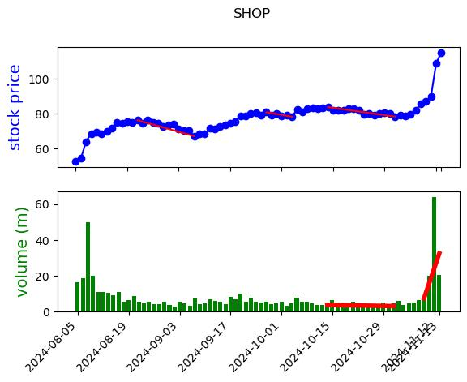

#### SRAD
- **Current Price**: 17.17
- **Support Price**: 12.3100004196167
- **Pressure Price**: 12.774999618530273
- **Good Pivot**: True
- **Deep Correction**: False
- **Demand Dry**: True

#### SWI
- **Current Price**: 13.65
- **Support Price**: 13.470000267028809
- **Pressure Price**: 13.989999771118164
- **Good Pivot**: True
- **Deep Correction**: False
- **Demand Dry**: True
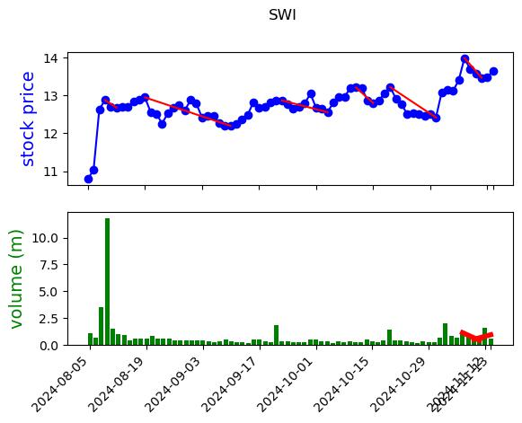

#### TEM
- **Current Price**: 68.08
- **Support Price**: 68.04000091552734
- **Pressure Price**: 77.62000274658203
- **Good Pivot**: True
- **Deep Correction**: False
- **Demand Dry**: True

#### TOST
- **Current Price**: 39.92
- **Support Price**: 29.25
- **Pressure Price**: 30.31999969482422
- **Good Pivot**: True
- **Deep Correction**: False
- **Demand Dry**: True
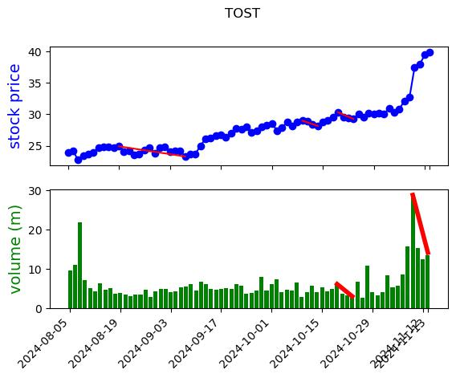

#### TRT
- **Current Price**: 6.7682
- **Support Price**: 6.599999904632568
- **Pressure Price**: 7.179999828338623
- **Good Pivot**: True
- **Deep Correction**: False
- **Demand Dry**: True
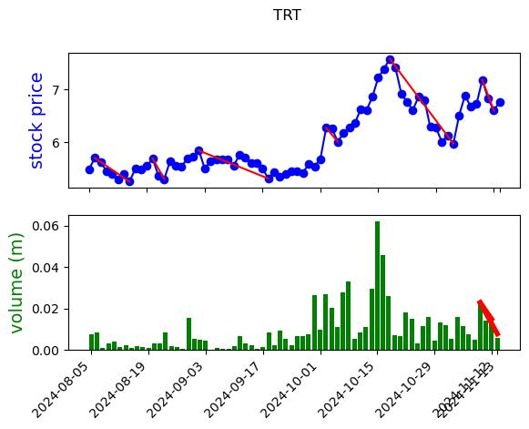

#### TSEM
- **Current Price**: 48.42
- **Support Price**: 41.029998779296875
- **Pressure Price**: 46.029998779296875
- **Good Pivot**: True
- **Deep Correction**: False
- **Demand Dry**: True
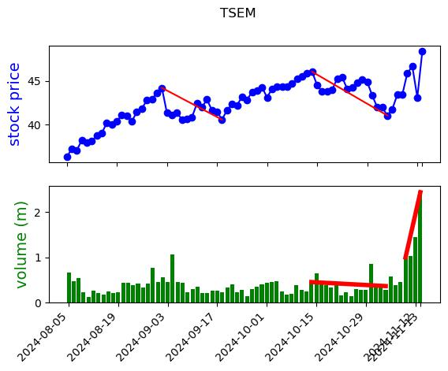

#### VERX
- **Current Price**: 50.58
- **Support Price**: 49.290000915527344
- **Pressure Price**: 51.9900016784668
- **Good Pivot**: True
- **Deep Correction**: False
- **Demand Dry**: True
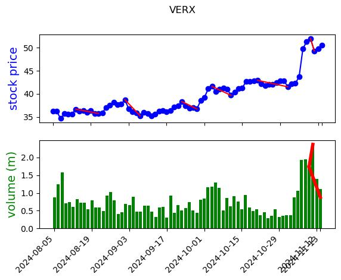

#### VICR
- **Current Price**: 57.07
- **Support Price**: 57.06999969482422
- **Pressure Price**: 60.939998626708984
- **Good Pivot**: True
- **Deep Correction**: False
- **Demand Dry**: True

#### WGS
- **Current Price**: 78.48
- **Support Price**: 74.86000061035156
- **Pressure Price**: 84.0199966430664
- **Good Pivot**: True
- **Deep Correction**: False
- **Demand Dry**: True

#### WIT
- **Current Price**: 6.87
- **Support Price**: 6.869999885559082
- **Pressure Price**: 7.0
- **Good Pivot**: True
- **Deep Correction**: False
- **Demand Dry**: True
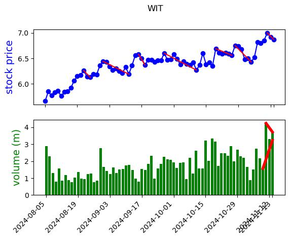

#### XNET
- **Current Price**: 2.11
- **Support Price**: 2.0999999046325684
- **Pressure Price**: 2.200000047683716
- **Good Pivot**: True
- **Deep Correction**: False
- **Demand Dry**: True
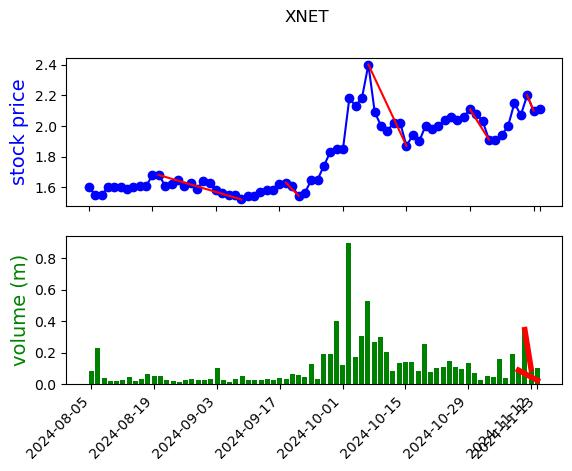

#### ZUO
- **Current Price**: 9.9
- **Support Price**: 9.890000343322754
- **Pressure Price**: 9.899999618530273
- **Good Pivot**: True
- **Deep Correction**: False
- **Demand Dry**: True
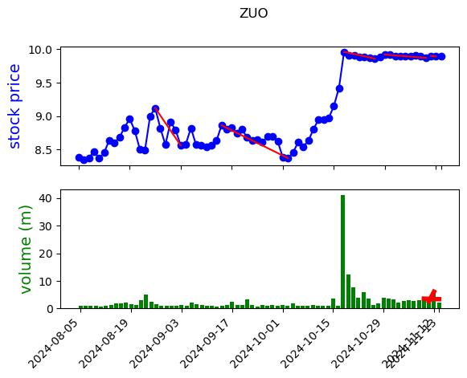

#### AGIO
- **Current Price**: 58.6
- **Support Price**: 58.599998474121094
- **Pressure Price**: 60.459999084472656
- **Good Pivot**: True
- **Deep Correction**: False
- **Demand Dry**: True
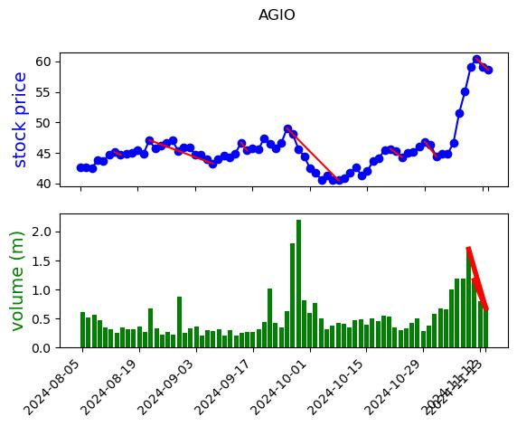

#### AIRS
- **Current Price**: 7.41
- **Support Price**: 7.409999847412109
- **Pressure Price**: 8.680000305175781
- **Good Pivot**: True
- **Deep Correction**: False
- **Demand Dry**: True

#### AORT
- **Current Price**: 27.21
- **Support Price**: 27.209999084472656
- **Pressure Price**: 29.440000534057617
- **Good Pivot**: True
- **Deep Correction**: False
- **Demand Dry**: True
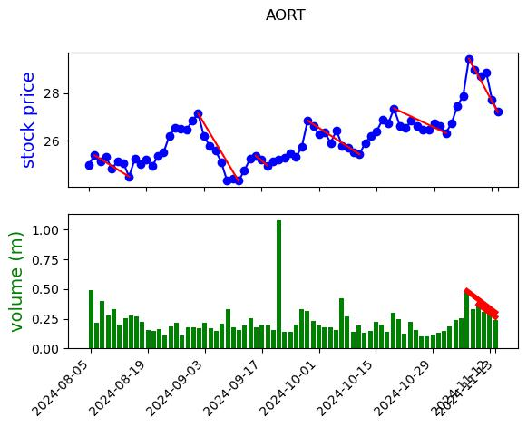

#### ATYR
- **Current Price**: 3.52
- **Support Price**: 3.0399999618530273
- **Pressure Price**: 3.3499999046325684
- **Good Pivot**: True
- **Deep Correction**: False
- **Demand Dry**: True

#### AVAH
- **Current Price**: 5.74
- **Support Price**: 5.739999771118164
- **Pressure Price**: 5.945000171661377
- **Good Pivot**: True
- **Deep Correction**: False
- **Demand Dry**: True

#### BLTE
- **Current Price**: 82.23
- **Support Price**: 78.63999938964844
- **Pressure Price**: 82.38999938964844
- **Good Pivot**: True
- **Deep Correction**: False
- **Demand Dry**: True
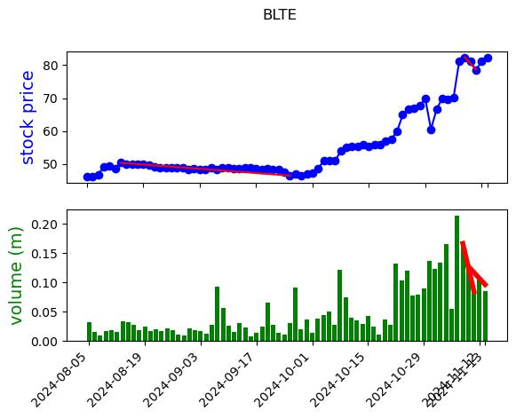

#### BNTX
- **Current Price**: 111.48
- **Support Price**: 106.63999938964844
- **Pressure Price**: 122.68000030517578
- **Good Pivot**: True
- **Deep Correction**: False
- **Demand Dry**: True
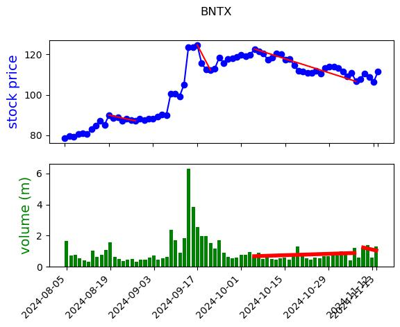

#### CAH
- **Current Price**: 125.33
- **Support Price**: 107.88999938964844
- **Pressure Price**: 114.54000091552734
- **Good Pivot**: True
- **Deep Correction**: False
- **Demand Dry**: True
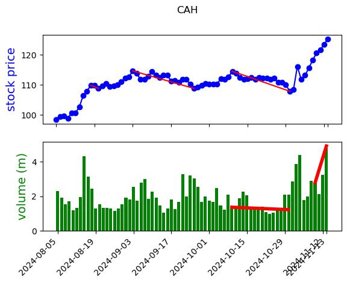

#### CDMO
- **Current Price**: 12.2
- **Support Price**: 12.199999809265137
- **Pressure Price**: 12.260000228881836
- **Good Pivot**: True
- **Deep Correction**: False
- **Demand Dry**: True

#### CKPT
- **Current Price**: 3.62
- **Support Price**: 3.299999952316284
- **Pressure Price**: 3.8399999141693115
- **Good Pivot**: True
- **Deep Correction**: False
- **Demand Dry**: True
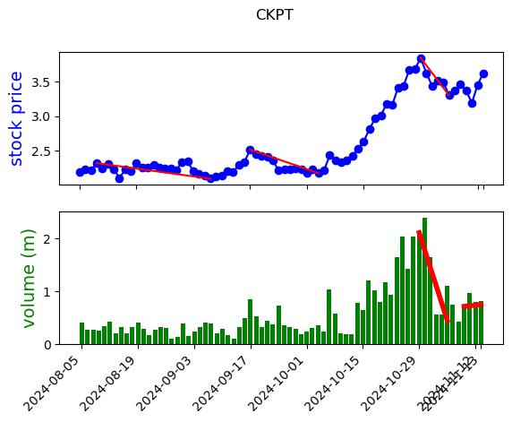

#### CLPT
- **Current Price**: 10.95
- **Support Price**: 10.949999809265137
- **Pressure Price**: 13.460000038146973
- **Good Pivot**: True
- **Deep Correction**: False
- **Demand Dry**: True

#### CNTA
- **Current Price**: 18.08
- **Support Price**: 15.149999618530273
- **Pressure Price**: 17.200000762939453
- **Good Pivot**: True
- **Deep Correction**: False
- **Demand Dry**: True

#### DCTH
- **Current Price**: 9.41
- **Support Price**: 9.40999984741211
- **Pressure Price**: 11.369999885559082
- **Good Pivot**: True
- **Deep Correction**: False
- **Demand Dry**: True
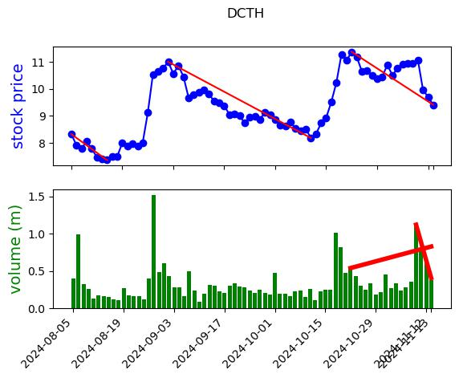

#### ELDN
- **Current Price**: 4.27
- **Support Price**: 4.269999980926514
- **Pressure Price**: 5.300000190734863
- **Good Pivot**: True
- **Deep Correction**: False
- **Demand Dry**: True

#### ETON
- **Current Price**: 10.6
- **Support Price**: 8.350000381469727
- **Pressure Price**: 8.699999809265137
- **Good Pivot**: True
- **Deep Correction**: False
- **Demand Dry**: True
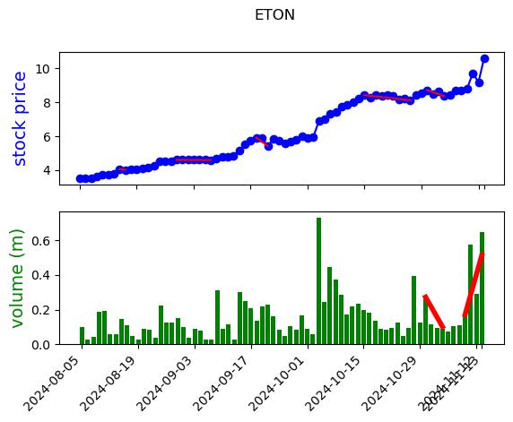

#### FTLF
- **Current Price**: 34.88
- **Support Price**: 31.25
- **Pressure Price**: 32.560001373291016
- **Good Pivot**: True
- **Deep Correction**: False
- **Demand Dry**: True

#### GILD
- **Current Price**: 92.63
- **Support Price**: 92.62999725341797
- **Pressure Price**: 97.9000015258789
- **Good Pivot**: True
- **Deep Correction**: False
- **Demand Dry**: True
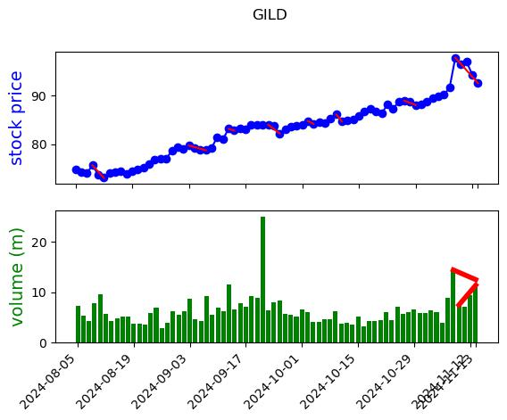

#### HIMS
- **Current Price**: 27.6
- **Support Price**: 26.690000534057617
- **Pressure Price**: 27.8799991607666
- **Good Pivot**: True
- **Deep Correction**: False
- **Demand Dry**: True
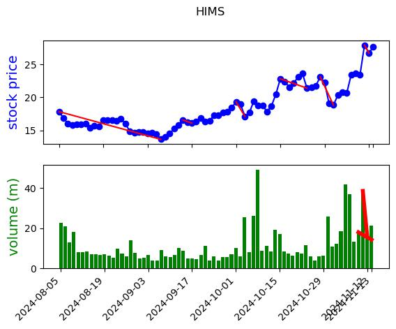

#### ICAD
- **Current Price**: 2.34
- **Support Price**: 2.3399999141693115
- **Pressure Price**: 2.4000000953674316
- **Good Pivot**: True
- **Deep Correction**: False
- **Demand Dry**: True
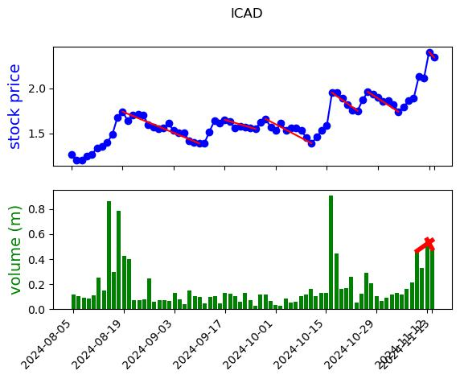

#### LGND
- **Current Price**: 122.08
- **Support Price**: 120.73999786376953
- **Pressure Price**: 129.89999389648438
- **Good Pivot**: True
- **Deep Correction**: False
- **Demand Dry**: True

#### LNSR
- **Current Price**: 7.39
- **Support Price**: 5.300000190734863
- **Pressure Price**: 5.789999961853027
- **Good Pivot**: True
- **Deep Correction**: False
- **Demand Dry**: True

#### MGTX
- **Current Price**: 7.04
- **Support Price**: 6.659999847412109
- **Pressure Price**: 7.099999904632568
- **Good Pivot**: True
- **Deep Correction**: False
- **Demand Dry**: True
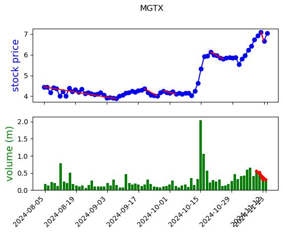

#### NXGL
- **Current Price**: 3.29
- **Support Price**: 3.1500000953674316
- **Pressure Price**: 3.5
- **Good Pivot**: True
- **Deep Correction**: False
- **Demand Dry**: True
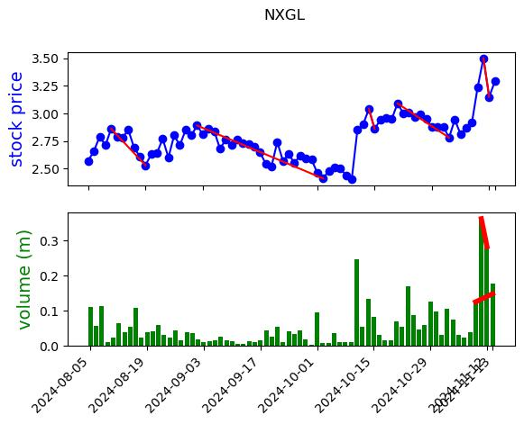

#### OFIX
- **Current Price**: 18.64
- **Support Price**: 18.639999389648438
- **Pressure Price**: 20.020000457763672
- **Good Pivot**: True
- **Deep Correction**: False
- **Demand Dry**: True
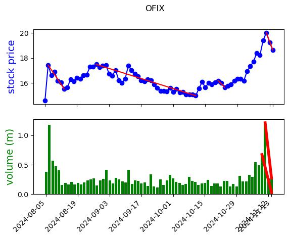

#### ORGO
- **Current Price**: 4.43
- **Support Price**: 2.799999952316284
- **Pressure Price**: 3.25
- **Good Pivot**: True
- **Deep Correction**: False
- **Demand Dry**: True
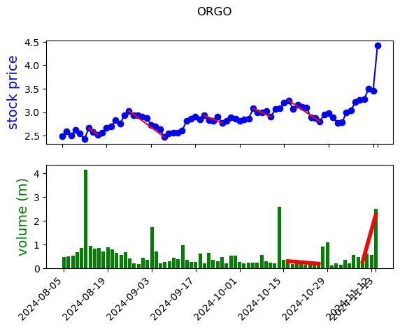

#### PAHC
- **Current Price**: 25.27
- **Support Price**: 25.059999465942383
- **Pressure Price**: 25.549999237060547
- **Good Pivot**: True
- **Deep Correction**: False
- **Demand Dry**: True
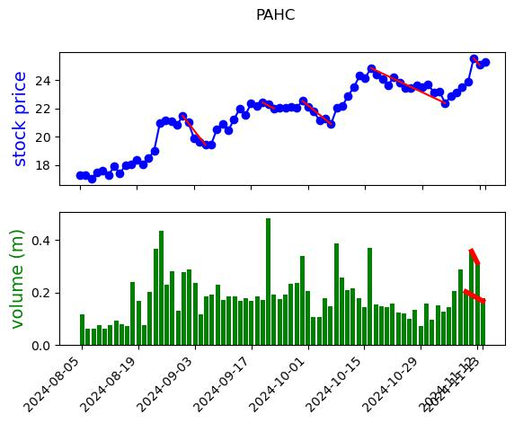

#### PDEX
- **Current Price**: 46.96
- **Support Price**: 46.959999084472656
- **Pressure Price**: 49.54999923706055
- **Good Pivot**: True
- **Deep Correction**: False
- **Demand Dry**: True

#### RDNT
- **Current Price**: 82.56
- **Support Price**: 82.55999755859375
- **Pressure Price**: 86.37999725341797
- **Good Pivot**: True
- **Deep Correction**: False
- **Demand Dry**: True

#### RIGL
- **Current Price**: 27.41
- **Support Price**: 13.630000114440918
- **Pressure Price**: 16.59000015258789
- **Good Pivot**: True
- **Deep Correction**: False
- **Demand Dry**: True
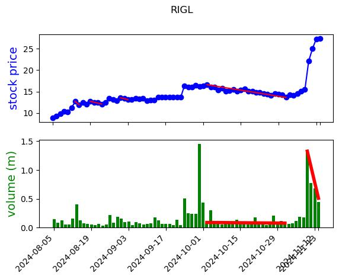

#### RYTM
- **Current Price**: 60.07
- **Support Price**: 60.06999969482422
- **Pressure Price**: 67.33000183105469
- **Good Pivot**: True
- **Deep Correction**: False
- **Demand Dry**: True

#### SPRY
- **Current Price**: 14.08
- **Support Price**: 14.079999923706055
- **Pressure Price**: 17.489999771118164
- **Good Pivot**: True
- **Deep Correction**: False
- **Demand Dry**: True
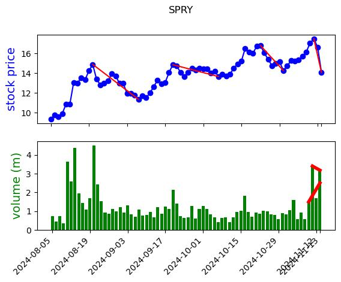

#### TGTX
- **Current Price**: 34.9
- **Support Price**: 23.1299991607666
- **Pressure Price**: 24.56999969482422
- **Good Pivot**: True
- **Deep Correction**: False
- **Demand Dry**: True
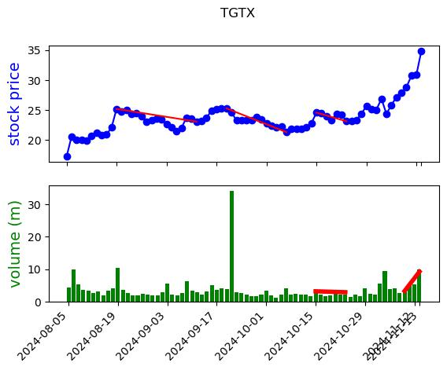

#### TRDA
- **Current Price**: 19.96
- **Support Price**: 16.84000015258789
- **Pressure Price**: 17.829999923706055
- **Good Pivot**: True
- **Deep Correction**: False
- **Demand Dry**: True

#### UPB
- **Current Price**: 25.91
- **Support Price**: 25.90999984741211
- **Pressure Price**: 27.389999389648438
- **Good Pivot**: True
- **Deep Correction**: False
- **Demand Dry**: True
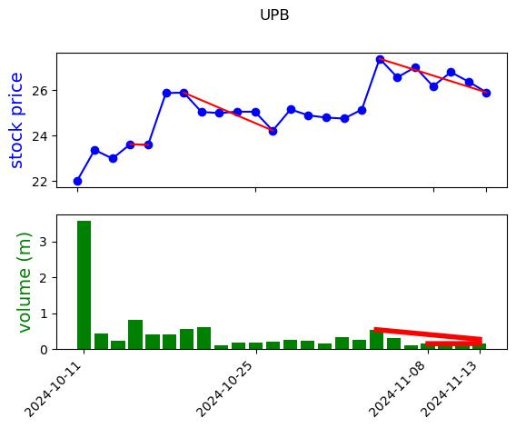

#### VMD
- **Current Price**: 9.15
- **Support Price**: 9.149999618530273
- **Pressure Price**: 9.510000228881836
- **Good Pivot**: True
- **Deep Correction**: False
- **Demand Dry**: True
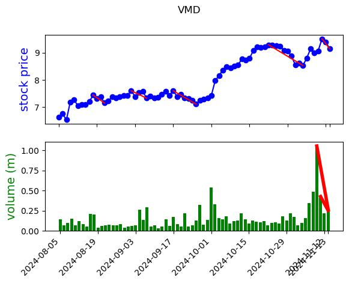

#### WVE
- **Current Price**: 15.69
- **Support Price**: 15.6899995803833
- **Pressure Price**: 16.440000534057617
- **Good Pivot**: True
- **Deep Correction**: False
- **Demand Dry**: True
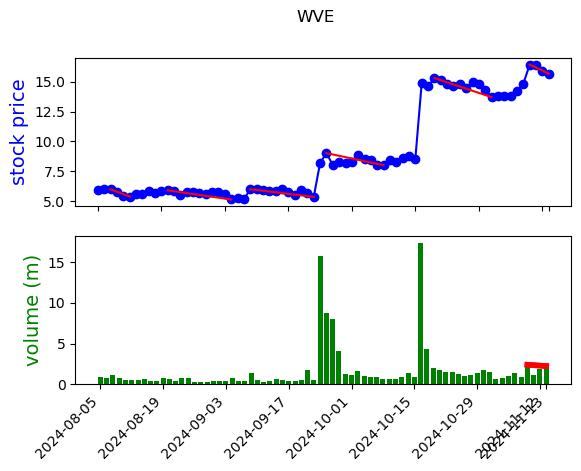

#### ZLAB
- **Current Price**: 29.95
- **Support Price**: 28.959999084472656
- **Pressure Price**: 33.18000030517578
- **Good Pivot**: True
- **Deep Correction**: False
- **Demand Dry**: True
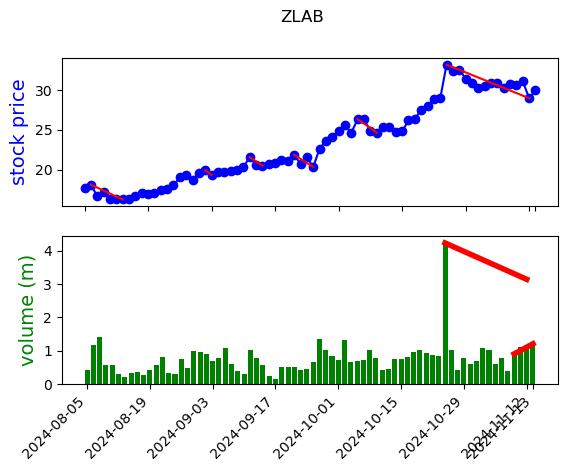

#### ABLLL
- **Current Price**: 27.02
- **Support Price**: 26.399999618530273
- **Pressure Price**: 27.299999237060547
- **Good Pivot**: True
- **Deep Correction**: False
- **Demand Dry**: True
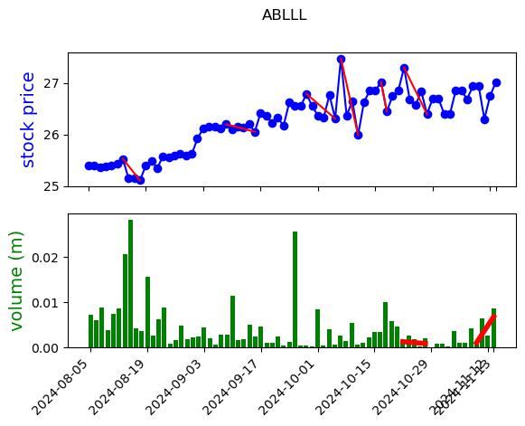

#### ACT
- **Current Price**: 34.3
- **Support Price**: 34.29999923706055
- **Pressure Price**: 34.619998931884766
- **Good Pivot**: True
- **Deep Correction**: False
- **Demand Dry**: True
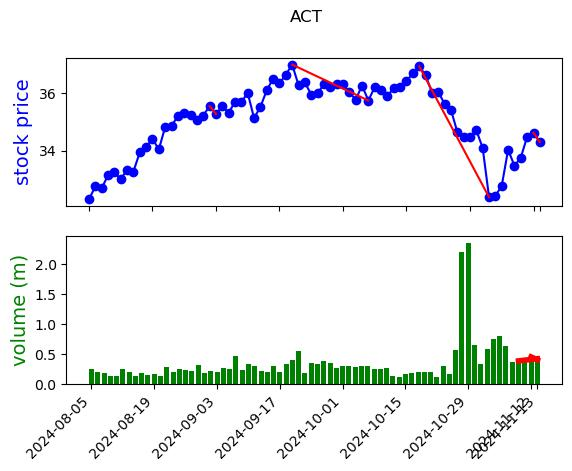

#### AFGD
- **Current Price**: 25.24
- **Support Price**: 24.225000381469727
- **Pressure Price**: 25.579999923706055
- **Good Pivot**: True
- **Deep Correction**: False
- **Demand Dry**: True

#### AFRM
- **Current Price**: 54.82
- **Support Price**: 54.81999969482422
- **Pressure Price**: 57.59000015258789
- **Good Pivot**: True
- **Deep Correction**: False
- **Demand Dry**: True
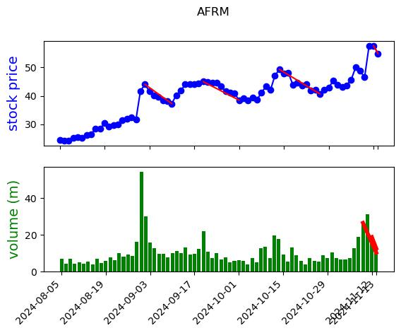

#### AGO
- **Current Price**: 88.95
- **Support Price**: 88.94999694824219
- **Pressure Price**: 91.41000366210938
- **Good Pivot**: True
- **Deep Correction**: False
- **Demand Dry**: True
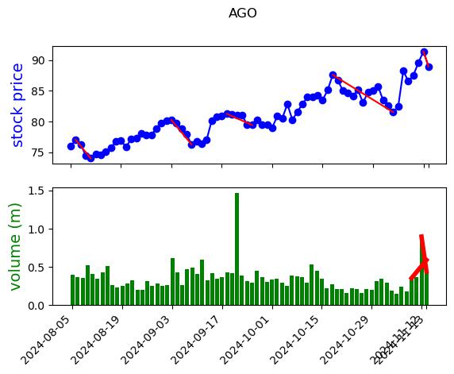

#### ATLC
- **Current Price**: 46.18
- **Support Price**: 36.439998626708984
- **Pressure Price**: 37.40999984741211
- **Good Pivot**: True
- **Deep Correction**: False
- **Demand Dry**: True
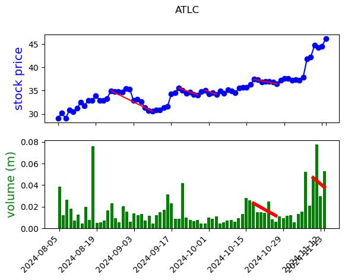

#### BAFN
- **Current Price**: 13.7
- **Support Price**: 13.430000305175781
- **Pressure Price**: 13.869999885559082
- **Good Pivot**: True
- **Deep Correction**: False
- **Demand Dry**: True
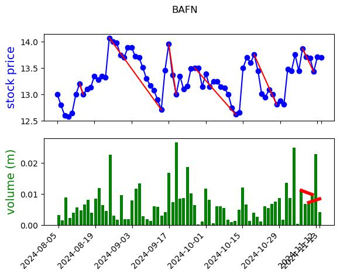

#### BANF
- **Current Price**: 122.57
- **Support Price**: 122.56999969482422
- **Pressure Price**: 126.5199966430664
- **Good Pivot**: True
- **Deep Correction**: False
- **Demand Dry**: True
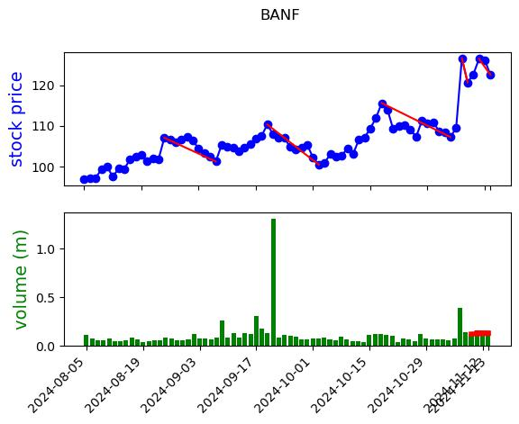

#### BGH
- **Current Price**: 15.41
- **Support Price**: 15.390000343322754
- **Pressure Price**: 16.15999984741211
- **Good Pivot**: True
- **Deep Correction**: False
- **Demand Dry**: True
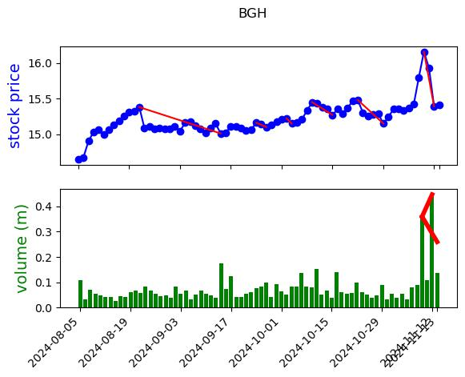

#### BHB
- **Current Price**: 35.44
- **Support Price**: 35.439998626708984
- **Pressure Price**: 38.22999954223633
- **Good Pivot**: True
- **Deep Correction**: False
- **Demand Dry**: True

#### BOW
- **Current Price**: 33.12
- **Support Price**: 33.119998931884766
- **Pressure Price**: 34.099998474121094
- **Good Pivot**: True
- **Deep Correction**: False
- **Demand Dry**: True
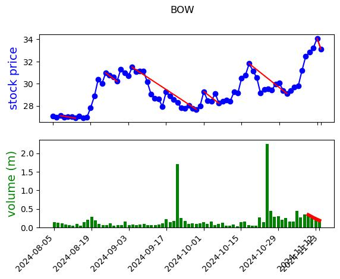

#### BRBS
- **Current Price**: 3.6
- **Support Price**: 2.75
- **Pressure Price**: 2.9600000381469727
- **Good Pivot**: True
- **Deep Correction**: False
- **Demand Dry**: True
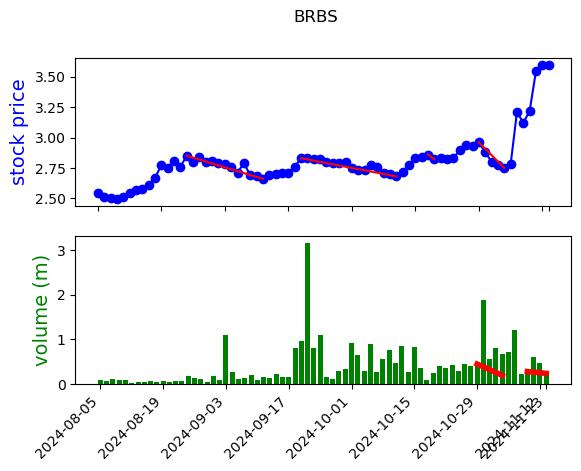

#### BSRR
- **Current Price**: 32.17
- **Support Price**: 32.16999816894531
- **Pressure Price**: 32.900001525878906
- **Good Pivot**: True
- **Deep Correction**: False
- **Demand Dry**: True
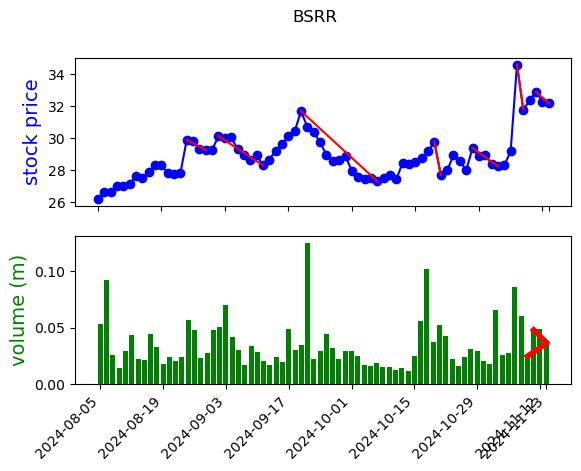

#### BTT
- **Current Price**: 21.26
- **Support Price**: 21.100000381469727
- **Pressure Price**: 21.260000228881836
- **Good Pivot**: True
- **Deep Correction**: False
- **Demand Dry**: True
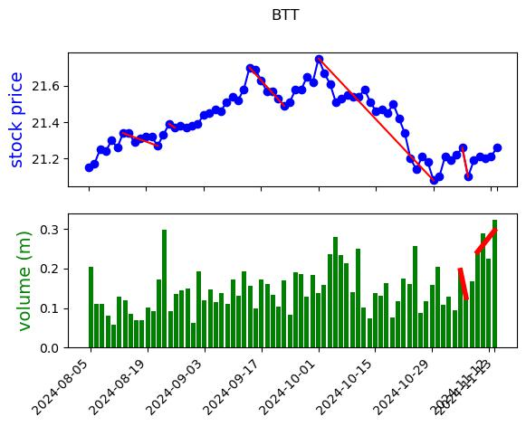

#### BWB
- **Current Price**: 15.04
- **Support Price**: 15.039999961853027
- **Pressure Price**: 15.25
- **Good Pivot**: True
- **Deep Correction**: False
- **Demand Dry**: True
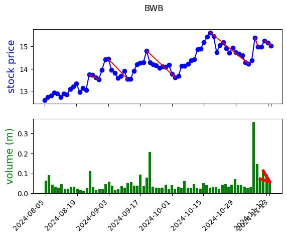

#### CBNK
- **Current Price**: 28.15
- **Support Price**: 28.149999618530273
- **Pressure Price**: 28.84000015258789
- **Good Pivot**: True
- **Deep Correction**: False
- **Demand Dry**: True
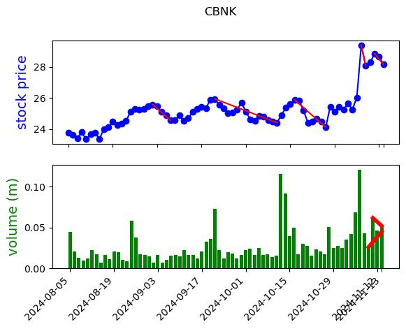

#### CCB
- **Current Price**: 73.66
- **Support Price**: 62.81999969482422
- **Pressure Price**: 66.56999969482422
- **Good Pivot**: True
- **Deep Correction**: False
- **Demand Dry**: True
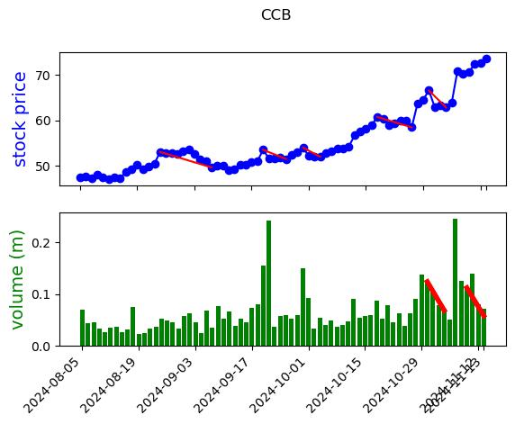

#### CEP
- **Current Price**: 10.17
- **Support Price**: 10.0600004196167
- **Pressure Price**: 10.100000381469727
- **Good Pivot**: True
- **Deep Correction**: False
- **Demand Dry**: True

#### CFBK
- **Current Price**: 28.25
- **Support Price**: 28.0
- **Pressure Price**: 29.549999237060547
- **Good Pivot**: True
- **Deep Correction**: False
- **Demand Dry**: True

#### CFFS
- **Current Price**: 11.16
- **Support Price**: 11.029999732971191
- **Pressure Price**: 11.039999961853027
- **Good Pivot**: True
- **Deep Correction**: False
- **Demand Dry**: True
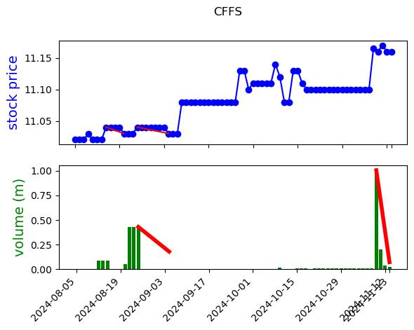

#### CIFR
- **Current Price**: 6.62
- **Support Price**: 6.619999885559082
- **Pressure Price**: 7.429999828338623
- **Good Pivot**: True
- **Deep Correction**: False
- **Demand Dry**: True

#### COF
- **Current Price**: 185.53
- **Support Price**: 185.52999877929688
- **Pressure Price**: 190.2100067138672
- **Good Pivot**: True
- **Deep Correction**: False
- **Demand Dry**: True
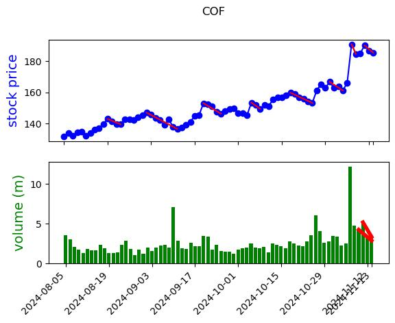

#### COFS
- **Current Price**: 35.87
- **Support Price**: 35.869998931884766
- **Pressure Price**: 36.0
- **Good Pivot**: True
- **Deep Correction**: False
- **Demand Dry**: True
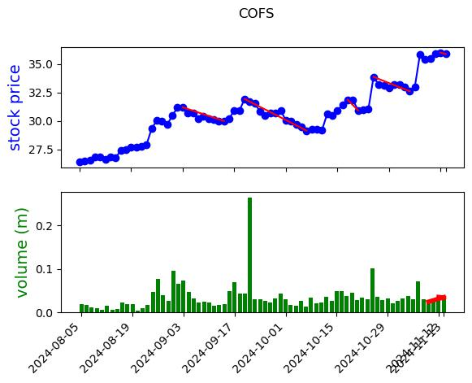

#### CORZ
- **Current Price**: 16.13
- **Support Price**: 16.1299991607666
- **Pressure Price**: 17.469999313354492
- **Good Pivot**: True
- **Deep Correction**: False
- **Demand Dry**: True
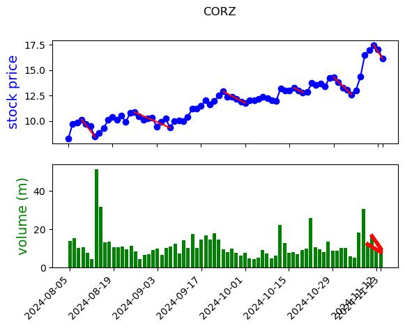

#### CPBI
- **Current Price**: 14.54
- **Support Price**: 14.539999961853027
- **Pressure Price**: 14.795000076293945
- **Good Pivot**: True
- **Deep Correction**: False
- **Demand Dry**: True

#### CPSS
- **Current Price**: 10.17
- **Support Price**: 9.9399995803833
- **Pressure Price**: 11.1899995803833
- **Good Pivot**: True
- **Deep Correction**: False
- **Demand Dry**: True
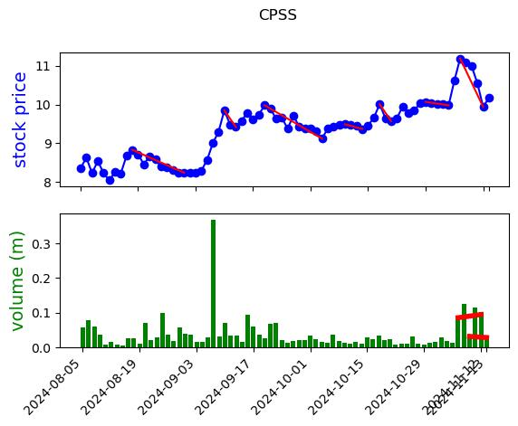

#### CRBG
- **Current Price**: 30.76
- **Support Price**: 30.68000030517578
- **Pressure Price**: 33.369998931884766
- **Good Pivot**: True
- **Deep Correction**: False
- **Demand Dry**: True
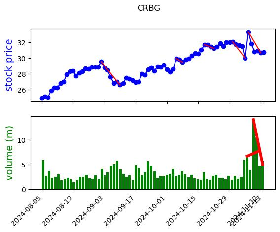

#### CRF
- **Current Price**: 9.17
- **Support Price**: 8.380000114440918
- **Pressure Price**: 8.4399995803833
- **Good Pivot**: True
- **Deep Correction**: False
- **Demand Dry**: True
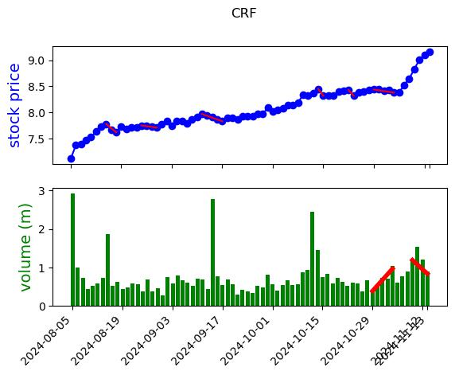

#### CURB
- **Current Price**: 24.15
- **Support Price**: 24.149999618530273
- **Pressure Price**: 24.59000015258789
- **Good Pivot**: True
- **Deep Correction**: False
- **Demand Dry**: True
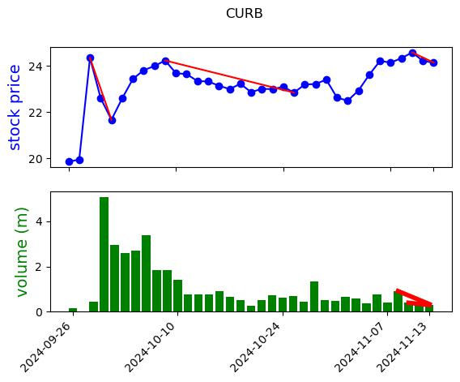

#### CWBC
- **Current Price**: 20.44
- **Support Price**: 18.530000686645508
- **Pressure Price**: 19.209999084472656
- **Good Pivot**: True
- **Deep Correction**: False
- **Demand Dry**: True
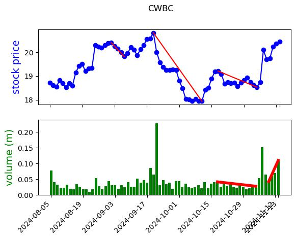

#### CZWI
- **Current Price**: 14.8
- **Support Price**: 14.0
- **Pressure Price**: 14.180000305175781
- **Good Pivot**: True
- **Deep Correction**: False
- **Demand Dry**: True

#### ECCC
- **Current Price**: 23.6
- **Support Price**: 23.530000686645508
- **Pressure Price**: 23.719999313354492
- **Good Pivot**: True
- **Deep Correction**: False
- **Demand Dry**: True
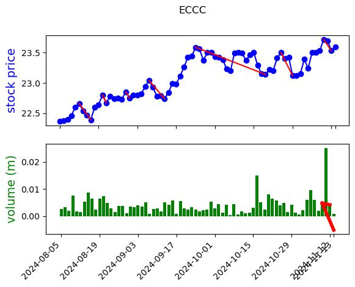

#### EMO
- **Current Price**: 46.64
- **Support Price**: 46.63999938964844
- **Pressure Price**: 46.810001373291016
- **Good Pivot**: True
- **Deep Correction**: False
- **Demand Dry**: True

#### FBIZ
- **Current Price**: 50.51
- **Support Price**: 50.5099983215332
- **Pressure Price**: 51.029998779296875
- **Good Pivot**: True
- **Deep Correction**: False
- **Demand Dry**: True
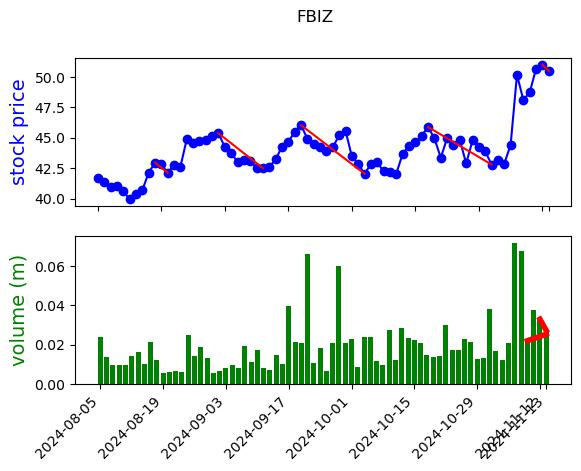

#### FBLA
- **Current Price**: 12.37
- **Support Price**: 12.369999885559082
- **Pressure Price**: 12.430000305175781
- **Good Pivot**: True
- **Deep Correction**: False
- **Demand Dry**: True

#### FCT
- **Current Price**: 10.33
- **Support Price**: 10.239999771118164
- **Pressure Price**: 10.329999923706055
- **Good Pivot**: True
- **Deep Correction**: False
- **Demand Dry**: True
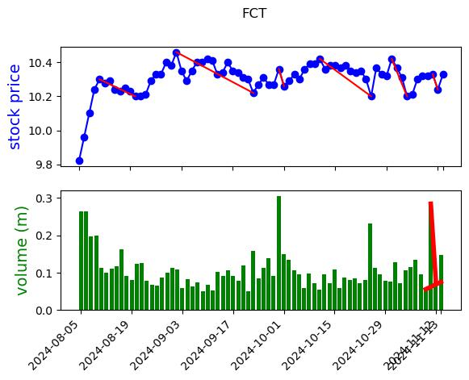

#### FDBC
- **Current Price**: 55.53
- **Support Price**: 55.529998779296875
- **Pressure Price**: 58.630001068115234
- **Good Pivot**: True
- **Deep Correction**: False
- **Demand Dry**: True
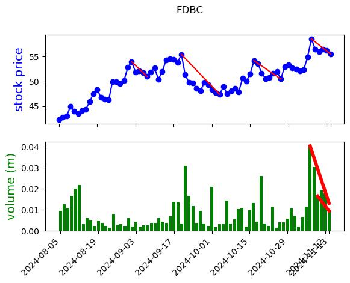

#### FDSB
- **Current Price**: 12.51
- **Support Price**: 10.899999618530273
- **Pressure Price**: 11.779999732971191
- **Good Pivot**: True
- **Deep Correction**: False
- **Demand Dry**: True
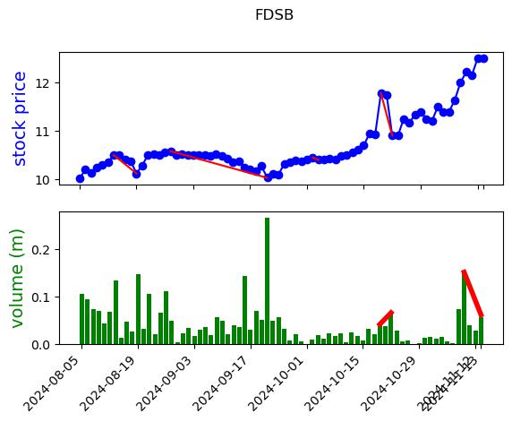

#### FINS
- **Current Price**: 12.79
- **Support Price**: 12.789999961853027
- **Pressure Price**: 13.289999961853027
- **Good Pivot**: True
- **Deep Correction**: False
- **Demand Dry**: True
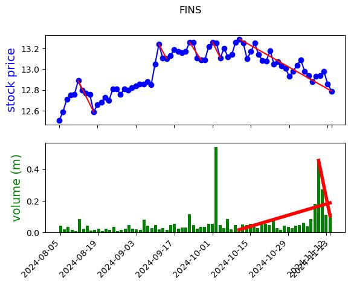

#### FLD
- **Current Price**: 10.94
- **Support Price**: 10.9399995803833
- **Pressure Price**: 10.949999809265137
- **Good Pivot**: True
- **Deep Correction**: False
- **Demand Dry**: True

#### FNLC
- **Current Price**: 28.82
- **Support Price**: 28.81999969482422
- **Pressure Price**: 31.020000457763672
- **Good Pivot**: True
- **Deep Correction**: False
- **Demand Dry**: True
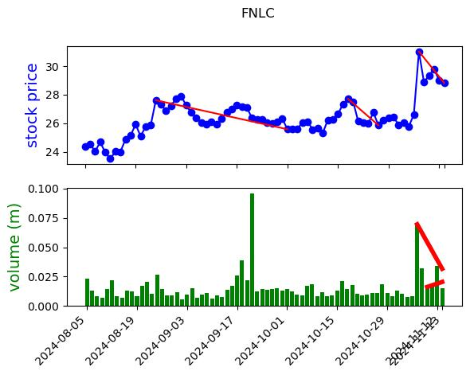

#### FOA
- **Current Price**: 18.82
- **Support Price**: 18.81999969482422
- **Pressure Price**: 20.950000762939453
- **Good Pivot**: True
- **Deep Correction**: False
- **Demand Dry**: True

#### FRHC
- **Current Price**: 114.61
- **Support Price**: 114.48999786376953
- **Pressure Price**: 115.86000061035156
- **Good Pivot**: True
- **Deep Correction**: False
- **Demand Dry**: True
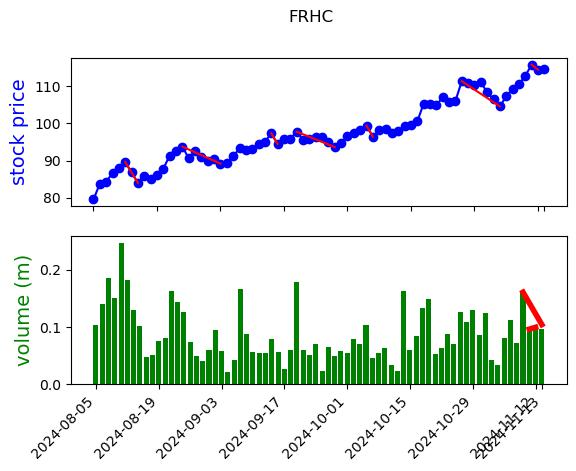

#### FRME
- **Current Price**: 43.57
- **Support Price**: 43.56999969482422
- **Pressure Price**: 44.540000915527344
- **Good Pivot**: True
- **Deep Correction**: False
- **Demand Dry**: True
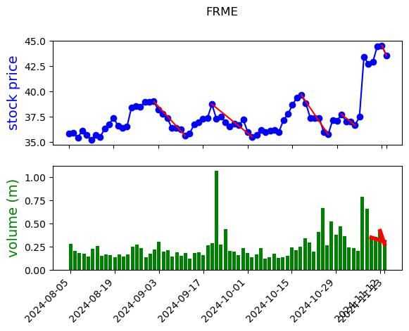

#### FSFG
- **Current Price**: 28.78
- **Support Price**: 24.309999465942383
- **Pressure Price**: 24.600000381469727
- **Good Pivot**: True
- **Deep Correction**: False
- **Demand Dry**: True

#### FXNC
- **Current Price**: 23.85
- **Support Price**: 20.719999313354492
- **Pressure Price**: 21.0
- **Good Pivot**: True
- **Deep Correction**: False
- **Demand Dry**: True
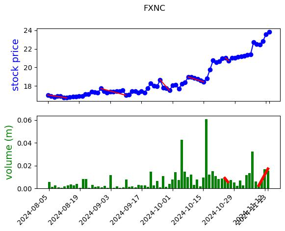

#### GCMG
- **Current Price**: 11.62
- **Support Price**: 11.479999542236328
- **Pressure Price**: 12.25
- **Good Pivot**: True
- **Deep Correction**: False
- **Demand Dry**: True

#### GIG
- **Current Price**: 9.95
- **Support Price**: 9.890000343322754
- **Pressure Price**: 9.930000305175781
- **Good Pivot**: True
- **Deep Correction**: False
- **Demand Dry**: True

#### GSBC
- **Current Price**: 63.59
- **Support Price**: 63.400001525878906
- **Pressure Price**: 66.91999816894531
- **Good Pivot**: True
- **Deep Correction**: False
- **Demand Dry**: True
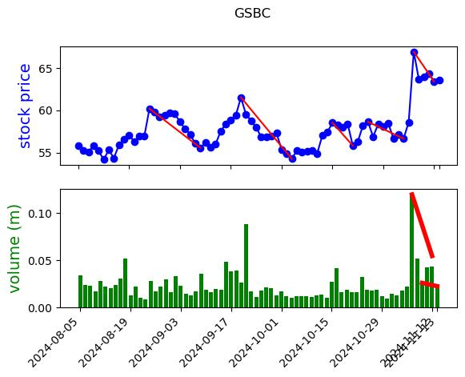

#### HIFS
- **Current Price**: 285.02
- **Support Price**: 285.0199890136719
- **Pressure Price**: 298.7699890136719
- **Good Pivot**: True
- **Deep Correction**: False
- **Demand Dry**: True

#### HNVR
- **Current Price**: 21.31
- **Support Price**: 17.139999389648438
- **Pressure Price**: 17.645000457763672
- **Good Pivot**: True
- **Deep Correction**: False
- **Demand Dry**: False

#### HNW
- **Current Price**: 12.29
- **Support Price**: 12.270000457763672
- **Pressure Price**: 12.390000343322754
- **Good Pivot**: True
- **Deep Correction**: False
- **Demand Dry**: True

#### HOMB
- **Current Price**: 30.8
- **Support Price**: 30.799999237060547
- **Pressure Price**: 31.25
- **Good Pivot**: True
- **Deep Correction**: False
- **Demand Dry**: True
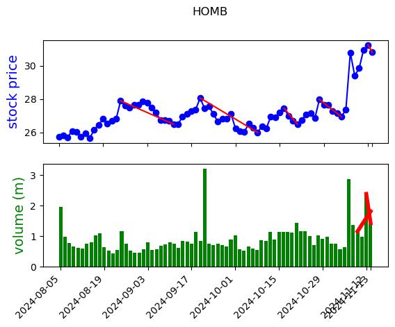

#### HOOD
- **Current Price**: 31.91
- **Support Price**: 31.90999984741211
- **Pressure Price**: 33.0
- **Good Pivot**: True
- **Deep Correction**: False
- **Demand Dry**: True

#### HUT
- **Current Price**: 24.78
- **Support Price**: 15.5600004196167
- **Pressure Price**: 18.155000686645508
- **Good Pivot**: True
- **Deep Correction**: False
- **Demand Dry**: True

#### HWBK
- **Current Price**: 28.12
- **Support Price**: 27.56999969482422
- **Pressure Price**: 28.440000534057617
- **Good Pivot**: True
- **Deep Correction**: False
- **Demand Dry**: True
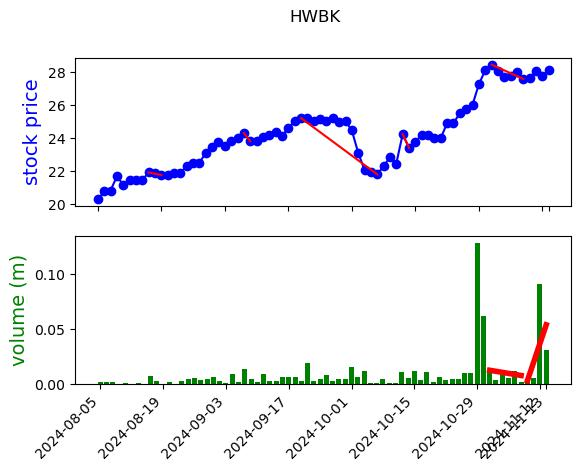

#### HYB
- **Current Price**: 8.14
- **Support Price**: 8.130000114440918
- **Pressure Price**: 8.1899995803833
- **Good Pivot**: True
- **Deep Correction**: False
- **Demand Dry**: True
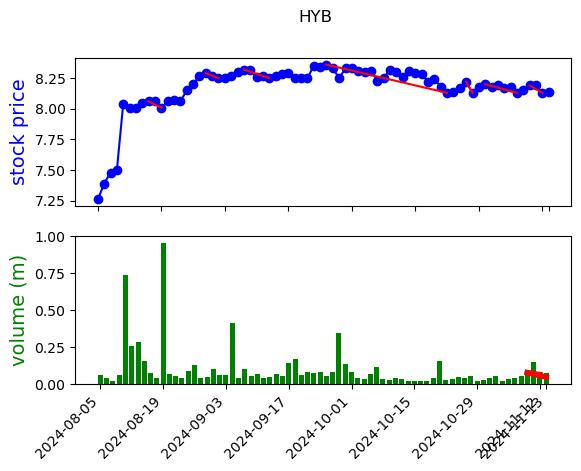

#### IBKR
- **Current Price**: 178.65
- **Support Price**: 178.64999389648438
- **Pressure Price**: 179.5500030517578
- **Good Pivot**: True
- **Deep Correction**: False
- **Demand Dry**: True

#### IPXX
- **Current Price**: 10.79
- **Support Price**: 10.789999961853027
- **Pressure Price**: 10.805000305175781
- **Good Pivot**: True
- **Deep Correction**: False
- **Demand Dry**: True
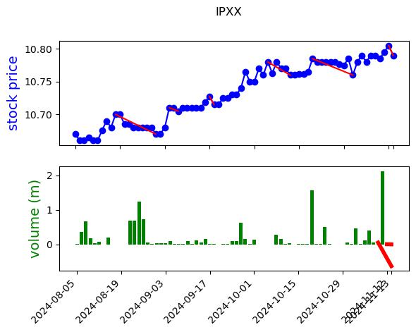

#### JEF
- **Current Price**: 74.58
- **Support Price**: 63.83000183105469
- **Pressure Price**: 67.26000213623047
- **Good Pivot**: True
- **Deep Correction**: False
- **Demand Dry**: True
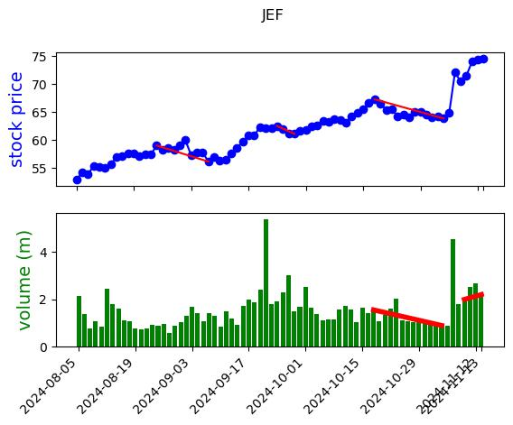

#### LMND
- **Current Price**: 31.99
- **Support Price**: 31.989999771118164
- **Pressure Price**: 34.2400016784668
- **Good Pivot**: True
- **Deep Correction**: False
- **Demand Dry**: True
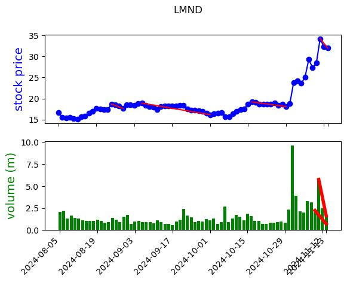

#### LSAK
- **Current Price**: 5.12
- **Support Price**: 5.119999885559082
- **Pressure Price**: 5.550000190734863
- **Good Pivot**: True
- **Deep Correction**: False
- **Demand Dry**: True

#### MBINN
- **Current Price**: 22.68
- **Support Price**: 22.475000381469727
- **Pressure Price**: 24.270000457763672
- **Good Pivot**: True
- **Deep Correction**: False
- **Demand Dry**: True
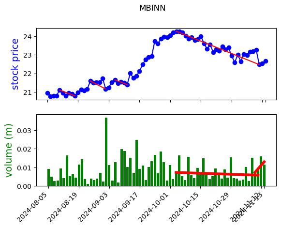

#### MOFG
- **Current Price**: 32.92
- **Support Price**: 32.91999816894531
- **Pressure Price**: 33.4900016784668
- **Good Pivot**: True
- **Deep Correction**: False
- **Demand Dry**: True
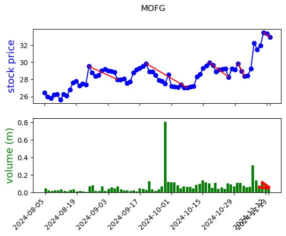

#### MPB
- **Current Price**: 32.48
- **Support Price**: 32.47999954223633
- **Pressure Price**: 33.02000045776367
- **Good Pivot**: True
- **Deep Correction**: False
- **Demand Dry**: True
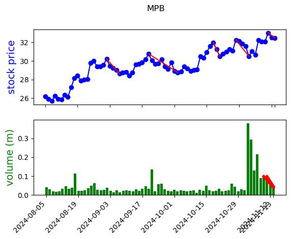

#### MRBK
- **Current Price**: 13.98
- **Support Price**: 13.789999961853027
- **Pressure Price**: 14.25
- **Good Pivot**: True
- **Deep Correction**: False
- **Demand Dry**: True

#### MRX
- **Current Price**: 28.46
- **Support Price**: 28.459999084472656
- **Pressure Price**: 29.0
- **Good Pivot**: True
- **Deep Correction**: False
- **Demand Dry**: True
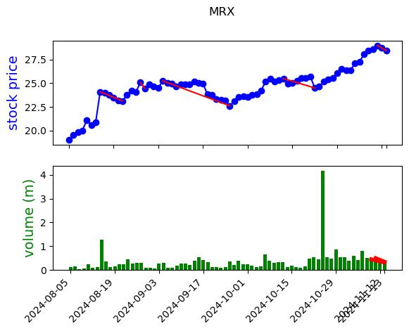

#### MUE
- **Current Price**: 10.52
- **Support Price**: 10.4399995803833
- **Pressure Price**: 10.520000457763672
- **Good Pivot**: True
- **Deep Correction**: False
- **Demand Dry**: True
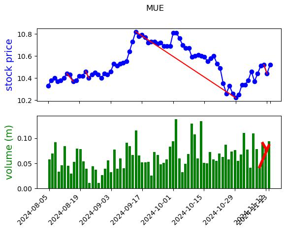

#### NAZ
- **Current Price**: 12.21
- **Support Price**: 11.5600004196167
- **Pressure Price**: 11.920000076293945
- **Good Pivot**: True
- **Deep Correction**: False
- **Demand Dry**: True
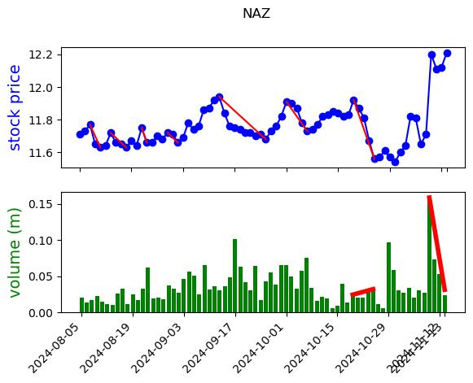

#### NBHC
- **Current Price**: 48.57
- **Support Price**: 48.56999969482422
- **Pressure Price**: 51.2400016784668
- **Good Pivot**: True
- **Deep Correction**: False
- **Demand Dry**: True
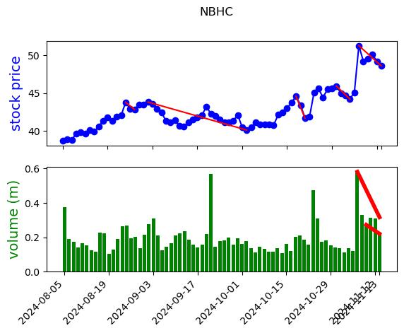

#### NBN
- **Current Price**: 102.24
- **Support Price**: 102.23999786376953
- **Pressure Price**: 103.33000183105469
- **Good Pivot**: True
- **Deep Correction**: False
- **Demand Dry**: True
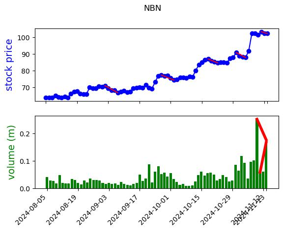

#### NCTY
- **Current Price**: 10.09
- **Support Price**: 8.180000305175781
- **Pressure Price**: 8.979999542236328
- **Good Pivot**: True
- **Deep Correction**: False
- **Demand Dry**: True
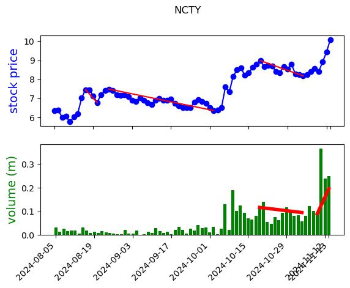

#### NCV
- **Current Price**: 3.51
- **Support Price**: 3.509999990463257
- **Pressure Price**: 3.559999942779541
- **Good Pivot**: True
- **Deep Correction**: False
- **Demand Dry**: True
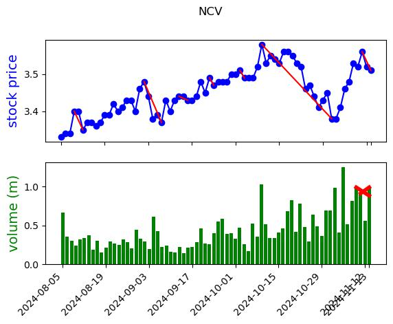

#### NEWT
- **Current Price**: 14.48
- **Support Price**: 14.479999542236328
- **Pressure Price**: 15.460000038146973
- **Good Pivot**: True
- **Deep Correction**: False
- **Demand Dry**: True
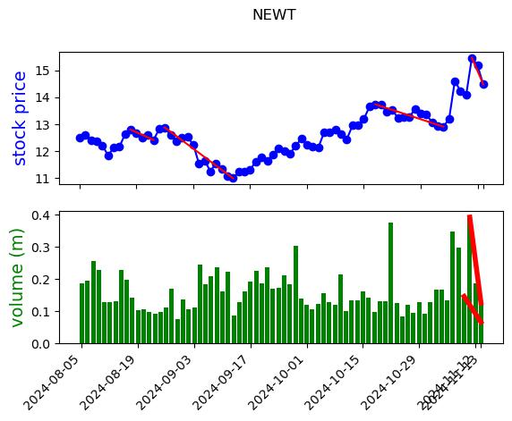

#### NRIM
- **Current Price**: 81.73
- **Support Price**: 73.77999877929688
- **Pressure Price**: 77.77999877929688
- **Good Pivot**: True
- **Deep Correction**: False
- **Demand Dry**: True

#### OBT
- **Current Price**: 62.55
- **Support Price**: 62.54999923706055
- **Pressure Price**: 63.79999923706055
- **Good Pivot**: True
- **Deep Correction**: False
- **Demand Dry**: True
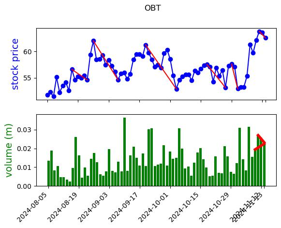

#### OPOF
- **Current Price**: 20.8
- **Support Price**: 20.799999237060547
- **Pressure Price**: 20.93000030517578
- **Good Pivot**: True
- **Deep Correction**: False
- **Demand Dry**: True
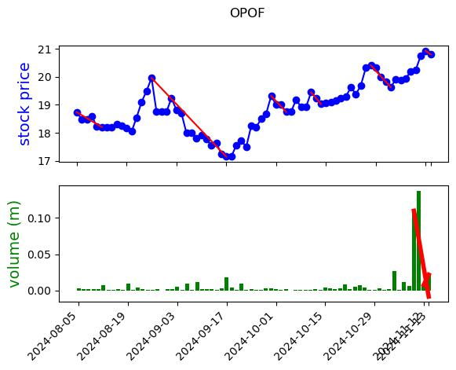

#### PFIS
- **Current Price**: 52.28
- **Support Price**: 52.279998779296875
- **Pressure Price**: 52.5
- **Good Pivot**: True
- **Deep Correction**: False
- **Demand Dry**: True
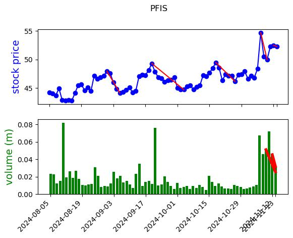

#### PFXNZ
- **Current Price**: 22.8
- **Support Price**: 22.530000686645508
- **Pressure Price**: 22.899999618530273
- **Good Pivot**: True
- **Deep Correction**: False
- **Demand Dry**: True

#### PHK
- **Current Price**: 4.99
- **Support Price**: 4.989999771118164
- **Pressure Price**: 5.099999904632568
- **Good Pivot**: True
- **Deep Correction**: False
- **Demand Dry**: True
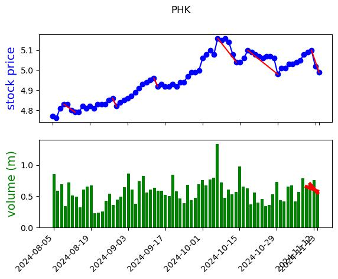

#### PLBC
- **Current Price**: 45.9
- **Support Price**: 41.150001525878906
- **Pressure Price**: 42.650001525878906
- **Good Pivot**: True
- **Deep Correction**: False
- **Demand Dry**: True

#### RVT
- **Current Price**: 16.415
- **Support Price**: 16.350000381469727
- **Pressure Price**: 16.899999618530273
- **Good Pivot**: True
- **Deep Correction**: False
- **Demand Dry**: True
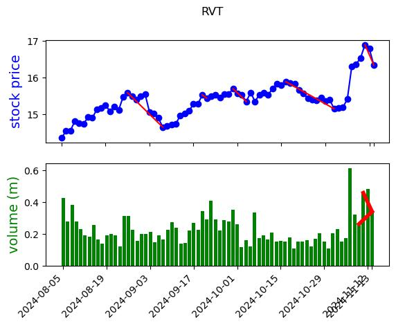

#### SASR
- **Current Price**: 37.94
- **Support Price**: 37.279998779296875
- **Pressure Price**: 38.5099983215332
- **Good Pivot**: True
- **Deep Correction**: False
- **Demand Dry**: True
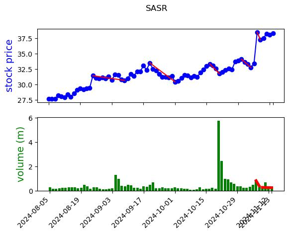

#### SCHW
- **Current Price**: 80.64
- **Support Price**: 70.83000183105469
- **Pressure Price**: 72.58999633789062
- **Good Pivot**: True
- **Deep Correction**: False
- **Demand Dry**: True
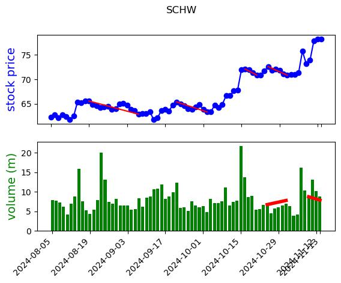

#### SIEB
- **Current Price**: 2.66
- **Support Price**: 2.440000057220459
- **Pressure Price**: 2.7300000190734863
- **Good Pivot**: True
- **Deep Correction**: False
- **Demand Dry**: True

#### SMBK
- **Current Price**: 36.03
- **Support Price**: 36.029998779296875
- **Pressure Price**: 36.54999923706055
- **Good Pivot**: True
- **Deep Correction**: False
- **Demand Dry**: True
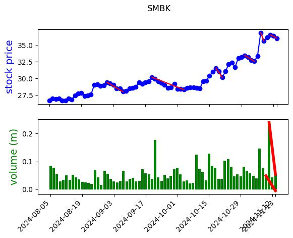

#### SNEX
- **Current Price**: 95.965
- **Support Price**: 95.66999816894531
- **Pressure Price**: 98.76000213623047
- **Good Pivot**: True
- **Deep Correction**: False
- **Demand Dry**: True

#### SPE
- **Current Price**: 14.975
- **Support Price**: 14.9399995803833
- **Pressure Price**: 15.220000267028809
- **Good Pivot**: True
- **Deep Correction**: False
- **Demand Dry**: True

#### SPFI
- **Current Price**: 39.5
- **Support Price**: 39.189998626708984
- **Pressure Price**: 40.5099983215332
- **Good Pivot**: True
- **Deep Correction**: False
- **Demand Dry**: True
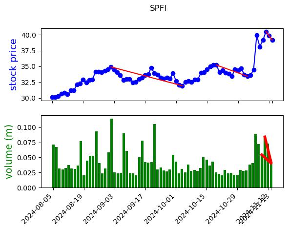

#### SSBK
- **Current Price**: 36.03
- **Support Price**: 36.029998779296875
- **Pressure Price**: 36.4900016784668
- **Good Pivot**: True
- **Deep Correction**: False
- **Demand Dry**: True
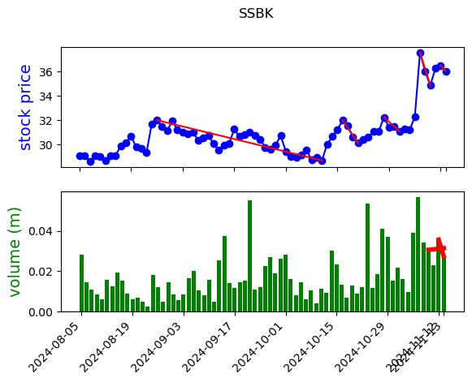

#### SSSS
- **Current Price**: 4.8023
- **Support Price**: 4.75
- **Pressure Price**: 5.400000095367432
- **Good Pivot**: True
- **Deep Correction**: False
- **Demand Dry**: True
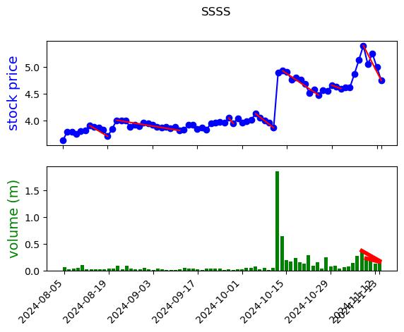

#### STEP
- **Current Price**: 64.39
- **Support Price**: 64.12000274658203
- **Pressure Price**: 69.31999969482422
- **Good Pivot**: True
- **Deep Correction**: False
- **Demand Dry**: True

#### TCBI
- **Current Price**: 88.9675
- **Support Price**: 75.95999908447266
- **Pressure Price**: 80.54000091552734
- **Good Pivot**: True
- **Deep Correction**: False
- **Demand Dry**: True
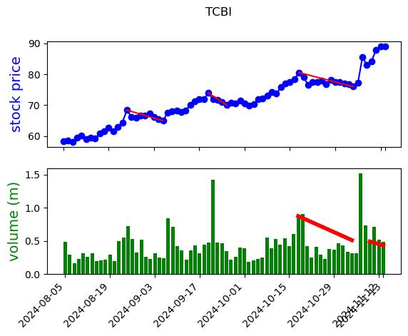

#### TRMK
- **Current Price**: 38.97
- **Support Price**: 38.7599983215332
- **Pressure Price**: 39.86000061035156
- **Good Pivot**: True
- **Deep Correction**: False
- **Demand Dry**: True
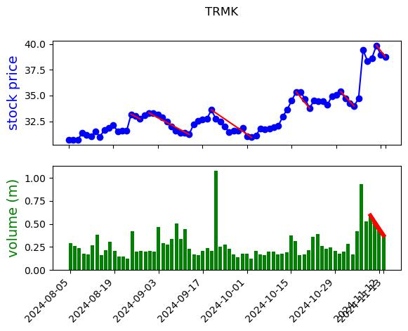

#### TWFG
- **Current Price**: 31.87
- **Support Price**: 31.610000610351562
- **Pressure Price**: 33.70000076293945
- **Good Pivot**: True
- **Deep Correction**: False
- **Demand Dry**: True
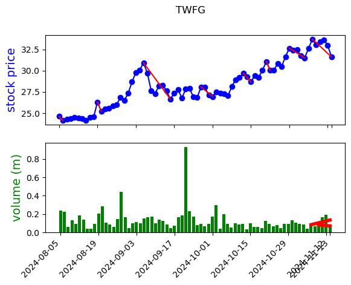

#### UBFO
- **Current Price**: 9.51
- **Support Price**: 8.619999885559082
- **Pressure Price**: 8.920000076293945
- **Good Pivot**: True
- **Deep Correction**: False
- **Demand Dry**: True

#### UMBF
- **Current Price**: 123.85
- **Support Price**: 123.80000305175781
- **Pressure Price**: 126.5
- **Good Pivot**: True
- **Deep Correction**: False
- **Demand Dry**: True
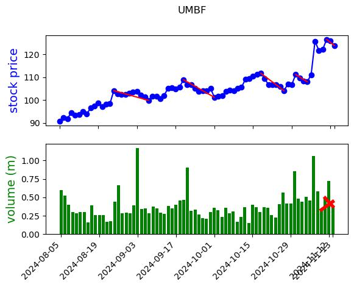

#### USCB
- **Current Price**: 20.41
- **Support Price**: 14.520000457763672
- **Pressure Price**: 14.949999809265137
- **Good Pivot**: True
- **Deep Correction**: False
- **Demand Dry**: True
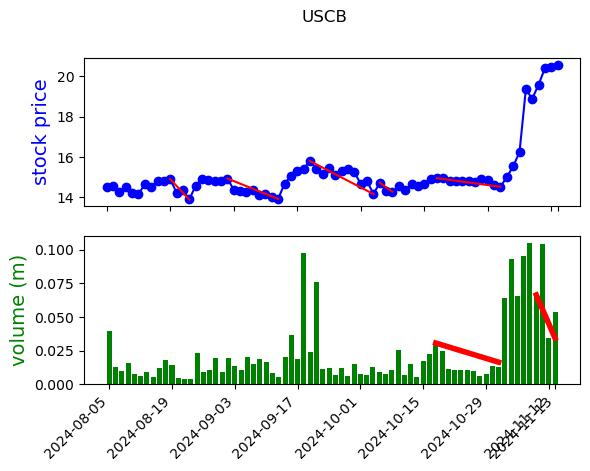

#### VALU
- **Current Price**: 56.0
- **Support Price**: 48.18000030517578
- **Pressure Price**: 53.650001525878906
- **Good Pivot**: True
- **Deep Correction**: False
- **Demand Dry**: True
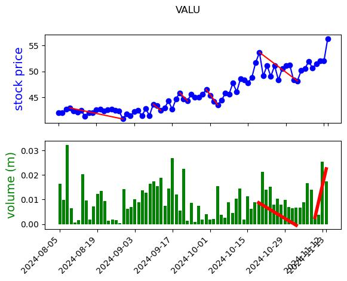

#### VLY
- **Current Price**: 10.215
- **Support Price**: 10.140000343322754
- **Pressure Price**: 10.239999771118164
- **Good Pivot**: True
- **Deep Correction**: False
- **Demand Dry**: True
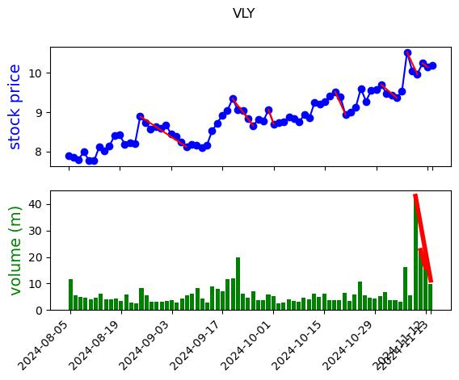

#### VTN
- **Current Price**: 11.33
- **Support Price**: 11.140000343322754
- **Pressure Price**: 11.619999885559082
- **Good Pivot**: True
- **Deep Correction**: False
- **Demand Dry**: True
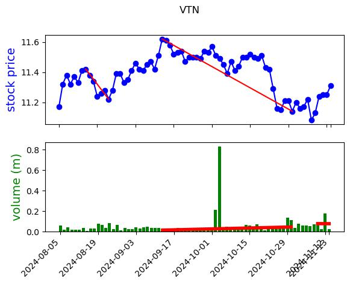

#### WSBC
- **Current Price**: 35.98
- **Support Price**: 35.880001068115234
- **Pressure Price**: 36.2599983215332
- **Good Pivot**: True
- **Deep Correction**: False
- **Demand Dry**: True

#### WSFS
- **Current Price**: 58.035
- **Support Price**: 55.959999084472656
- **Pressure Price**: 58.68000030517578
- **Good Pivot**: True
- **Deep Correction**: False
- **Demand Dry**: True

#### WT
- **Current Price**: 11.3601
- **Support Price**: 11.329999923706055
- **Pressure Price**: 11.630000114440918
- **Good Pivot**: True
- **Deep Correction**: False
- **Demand Dry**: True
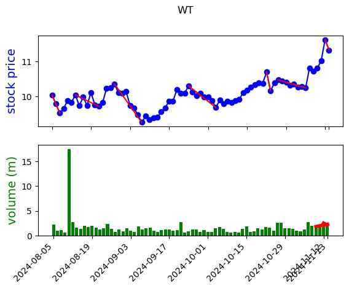

#### WTM
- **Current Price**: 1911.77
- **Support Price**: 1774.0699462890625
- **Pressure Price**: 1884.6099853515625
- **Good Pivot**: True
- **Deep Correction**: False
- **Demand Dry**: True

#### WTW
- **Current Price**: 317.18
- **Support Price**: 315.17999267578125
- **Pressure Price**: 317.30999755859375
- **Good Pivot**: True
- **Deep Correction**: False
- **Demand Dry**: True
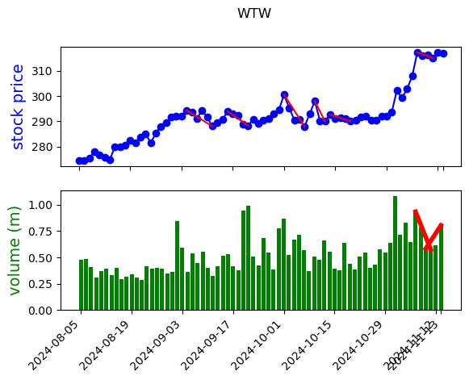

#### BKV
- **Current Price**: 20.72
- **Support Price**: 20.489999771118164
- **Pressure Price**: 20.700000762939453
- **Good Pivot**: True
- **Deep Correction**: False
- **Demand Dry**: True
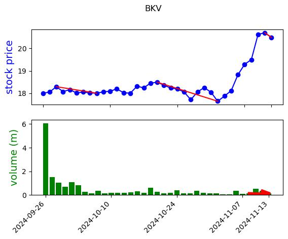

#### CLMT
- **Current Price**: 19.935
- **Support Price**: 19.899999618530273
- **Pressure Price**: 22.25
- **Good Pivot**: True
- **Deep Correction**: False
- **Demand Dry**: True
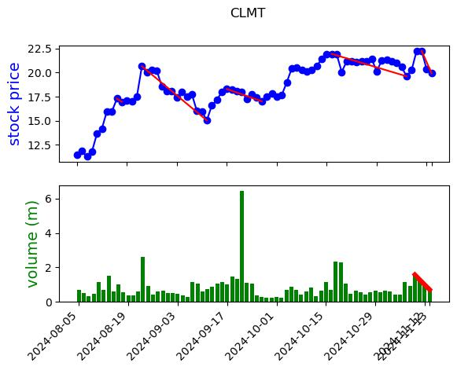

#### HNRG
- **Current Price**: 13.36
- **Support Price**: 8.895000457763672
- **Pressure Price**: 10.59000015258789
- **Good Pivot**: True
- **Deep Correction**: False
- **Demand Dry**: True
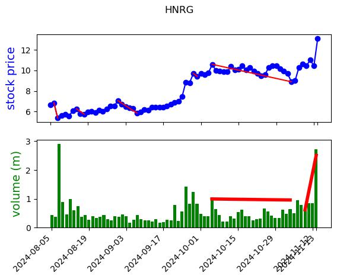

#### LB
- **Current Price**: 67.76
- **Support Price**: 67.18000030517578
- **Pressure Price**: 75.5
- **Good Pivot**: True
- **Deep Correction**: False
- **Demand Dry**: True
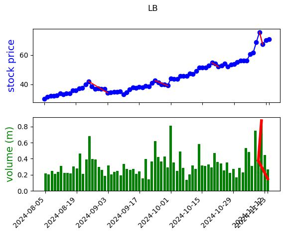

#### RNGR
- **Current Price**: 15.14
- **Support Price**: 12.279999732971191
- **Pressure Price**: 12.529999732971191
- **Good Pivot**: True
- **Deep Correction**: False
- **Demand Dry**: True
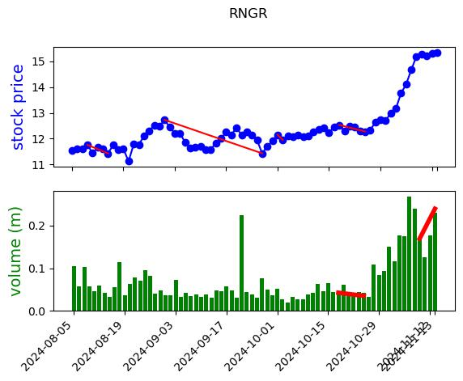

#### SOC
- **Current Price**: 23.39
- **Support Price**: 22.790000915527344
- **Pressure Price**: 24.079999923706055
- **Good Pivot**: True
- **Deep Correction**: False
- **Demand Dry**: True
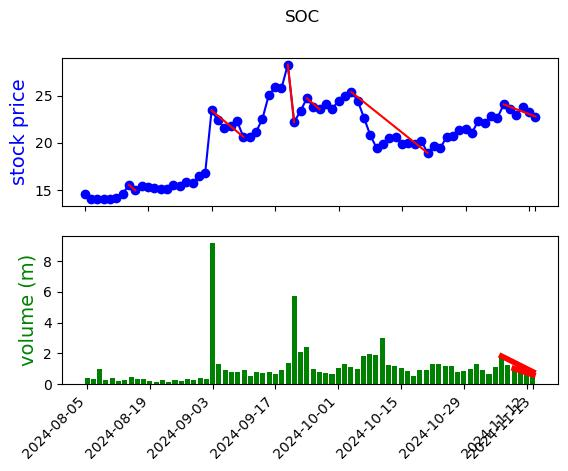

#### USEG
- **Current Price**: 1.49
- **Support Price**: 1.3200000524520874
- **Pressure Price**: 1.559999942779541
- **Good Pivot**: True
- **Deep Correction**: False
- **Demand Dry**: True
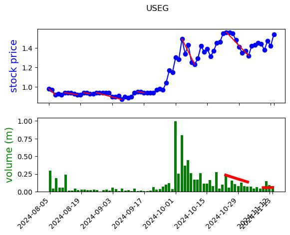

#### WTTR
- **Current Price**: 13.68
- **Support Price**: 13.640000343322754
- **Pressure Price**: 14.260000228881836
- **Good Pivot**: True
- **Deep Correction**: False
- **Demand Dry**: True
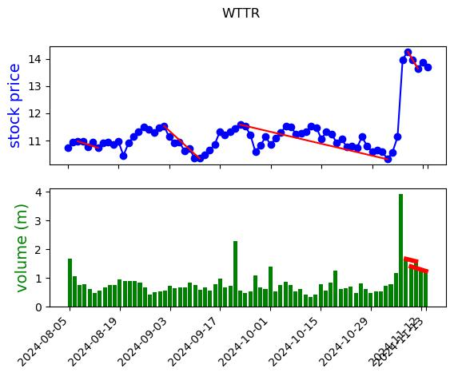

